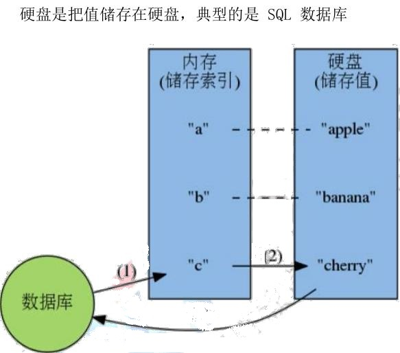
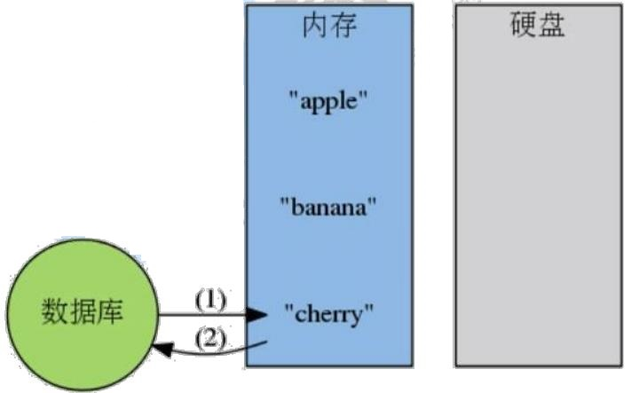
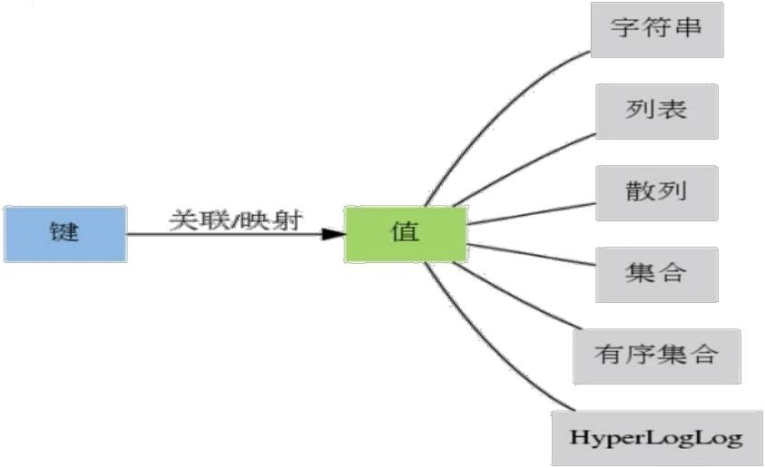

# 一、Redis的简介

## 1、前情提要

**磁盘数据库**： 

 MySQL（关系型数据库）
 Hbase



**内存数据库**：
  Redis
  memcached
  （成本高、性能好、读写速度快、数据安全性低、直接把值放到内存里面，内存数据库就直接把值取到）



## 2、用作数据库、缓存和消息中间件

> 二八法则：80%是经常被查询，使用内存数据库做缓存中间件，读取性能高

# 二、Redis的特点

## 1、数据结构丰富

Redis虽然是键值对数据库，但他支持多种类型的数据结构（主要是不同类型的value）

> 字符串、散列（hashes），列表（lists），集合（sets），有序集合（sorted sets）



## 2、数据的持久化

Redis 支持数据的持久化，可以将内存中的数据保持在磁盘中，重启的时候可以再次加载到内存进行使用

## 3、数据的备份

Redis 支持数据的备份，即 master-slave 模式的数据备份。

# 三、Redis的安装

## 1、下载安装包

redis-3.2.9.tar.gz 

网址：http://www.redis.cn/download.html

## 2、依赖软件安装 

```
yum install gcc tcl -y
```

## 3、解压 redis 

并进入解压目录

```
tar -zvxf redis-3.2.9.tar.gz 
```

## 4、 执行 编译命令

（`注意：`当前路径下需包含 makefile文件  ： 用于手动编译）

```
make && make install
```

## 5、修改 redis 的配置文件

 redis.config ( 先 备份一个原厂配置文件)

```shell
vim redis.config
```

* 修改运行模式为后台运行（如果为no，启动redis-server后，控制台就会卡在启动状态）daemonize守护进程

```properties
daemonize yes
```


* 指定redis数据持久化的路径(在执行redis-cli命令的当前路径，会生成dump.rdb文件)

```properties
dir   ./
```


* 使用默认的 redis.conf 文件，redis 默认只能通过 127.0.0.1:6379 这个地址访问，这样就只能在本机上操作了
* 想要远程操作，需要修改redis.conf 这个配置文件，在配置文件中添加相应的 ip 地址， 在bind 127.0.0.1 后面追加

```properties
bind 127.0.0.1 192.168.198.128
```


## 6、启动server服务

（如在redis的解压目录下）

> 命令： redis-server 配置文件的地址

```shell
 redis-server redis-conf
```

终止服务：（查询redis进程号，然后，kill该进程）

```
ps -ef | grep redis
kill 进程号
```

## 7、启动客户端服务

```shell
redis-cli
```

客户端命令格式：redis-cli –h host –p port

显示：

> 127.0.0.1:6379> 


# 四、Redis的使用

## 0、前情提要

Redis的key 值是二进制安全的，这意味着可以用任何二进制序列作为 key值。

## 1、切换数据库（实例）

> select databaseid 默认共有 16 个实例库，
>
> 登录时是 ID 为0 的数据库，总共有 16 个

```
select 0
```

## 2、Key操作：

（前提：是针对已经存在key）

> KEYS pattern
> 查找所有符合给定模式 pattern 的 key 。
>
> ```shell
> keys * 
> ```
>
> 列出所有Key


> EXISTS  key
> 检查给定 key 是否存在。
>
> ```
> EXISTS  name
> ```
>
> 若显示0，则不存在；若显示1，则存在


> EXPIRE key seconds
> 为给定 key 设置生存时间，当 key 过期时(生存时间为 0 )，它会被自动删除。
>
> ```
> EXPIRE age 1
> ```
>
> 若设置成功，显示1；显示0 ，则为失败，可能是该key不存在


> TTL key
> 以秒为单位，返回给定 key 的剩余生存时间


> MOVE key db
>
> 将当前数据库的 key 移动到给定的数据库 db 当中。
> 如果当前数据库(源数据库)和给定数据库(目标数据库)有相同名字的给定 key ，或者 key 不存在于当前数据库，那么 MOVE 没有任何效果
>
> ```
>  move name 1
> ```
>
> name 是数据库0中已存在的key，移动到数据库1中后，0中就不存在该key


> TYPE key
>
> 返回 key 所储存的值的类型。


> ```
> DEL key [key ...]
> ```
>
>
> 删除给定的一个或多个 key 。不存在的 key 会被忽略


## 3、String  操作

字符串是一种最基本的 Redis 值类型。Redis 字符串是二进制安全的，这
意味着一个 Redis 字符串能包含任意类型的数据


> ```
> SET key value [EX seconds][PX milliseconds] [NX|XX]
> ```
>
>
>  EX 设置过期时间，秒，等同于 SETEX key seconds value
>  PX 设置过期时间，毫秒，等同于 PSETEX key milliseconds value
>  NX 键不存在，才能设置，等同于 SETNX key value
>  XX 键存在时，才能设置

`注意`

将字符串值 value 关联到 key 。
如果 key 已经持有其他值， SET 就覆写旧值，无视类型。
对于某个原本带有生存时间（TTL）的键来说， 当 SET 命令成功在这个键上执行时， 这个键原有的 TTL 将被清除。


> ```
> GET key
> ```
>
> 返回 key 所关联的字符串值。如果 key 不存在那么返回特殊值 nil 。
> 假如 key 储存的值不是字符串类型，返回一个错误，因为 GET 只能
> 用于处理字符串值


> ```
> APPEND key value
> ```
>
> 如果 key 已经存在并且是一个字符串， APPEND 命令将 value 追加到 key 原来的值的末尾。
> 如果 key 不存在， APPEND 就简单地将给定 key 设为 value ，就像执行 SET key value 一样。


> ```
> STRLEN key
> ```
>
> 返回 key 所储存的字符串值的长度。
> 当 key 储存的不是字符串值时，返回一个错误。


> ```
> INCR key
> ```
>
> 将 key 中储存的数字值增一，并显示。
> 如果 key 不存在，那么 key 的值会先被初始化为 0 ，然后再执行INCR 操作。
> 如果值包含错误的类型，或字符串类型的值不能表示为数字，那么返回一个错误。
>
> `错误：`
>
> (error) ERR value is not an integer or out of range


> ```
> INCRBY key increment
> ```
>
> 将 key 所储存的值加上增量 increment ，并显示。
> 如果 key 不存在，那么 key 的值会先被初始化为 0 ，然后再执行INCRBY 命令。
> 如果值包含错误的类型，或字符串类型的值不能表示为数字，那么返回一个错误。


> ```
> DECR key
> ```
>
> 将 key 中储存的数字值减一。
>
> ```
> DECRBY key decrement
> ```
>
> 将 key 所储存的值减去减量 decrement 。
>


> ```
>  GETRANGE key start end
> ```
>
> 返回 key 中字符串值的子字符串，字符串的截取范围由 start 和end 两个偏移量决定(包括 start 和 end 在内)。
> 负数偏移量表示从字符串最后开始计数， -1 表示最后一个字符， -2 表示倒数第二个，以此类推


> ```
> SETRANGE key offset value
> ```
>
> 用 value 参数覆写(overwrite)给定 key 所储存的字符串值，从偏移量 offset 开始。
> 不存在的 key 当作空白字符串处理。


> ```
> SETEX key  seconds value
> ```
>
> 将值 value 关联到 key ，并将 key 的生存时间设为 seconds
> 如果 key 已经存在， SETEX 命令将覆写旧值。
> 这个命令类似于以下两个命令：
>
> ```
> SET key value
> EXPIRE key seconds # 设置生存时间
> ```
>
>

>
> 不同之处是， SETEX 是一个原子性(atomic)操作，关联值和设置生存时间两个动作会在同一时间内完成，该命令在 Redis 用作缓存时，非常实用。


> ```shell
> SETNX key value
> ```
>
>
> 将 key 的值设为 value ，当且仅当 key 不存在。
> 若给定的 key 已经存在，则 SETNX 不做任何动作。
> SETNX 是『SET if Not eXists』(如果不存在，则 SET)的简写。


> ```
> MGET key [key ...]
> ```
>
> 返回所有(一个或多个)给定 key 的值。
> 如果给定的 key 里面，有某个 key 不存在，那么这个 key 返回特殊值 nil 。因此，该命令永不失败


> ```
> MSET key value [key value ...]
> ```
>
> 同时设置一个或多个 key-value 对。
> 如果某个给定 key 已经存在，那么 MSET 会用新值覆盖原来的旧值，如果这不是你所希望的效果，请考虑使用 MSETNX 命令：它只会在所有给定 key 都不存在的情况下进行设置操作。


> ```
> MSETNX key value [key value ...]
> ```
>
> 同时设置一个或多个 key-value 对，当且仅当所有给定 key 都不存在。
> 即使只有一个给定 key 已存在， MSETNX 也会拒绝执行所有给定 key 的设置操作。
> MSETNX 是原子性的，因此它可以用作设置多个不同 key 表示不同字段(field)的唯一性逻辑对象(unique logic object)，所有字段要么全被设置，要么全不被设置。


## 4、 List 操作

> ```
> LPUSH key value [value ...]
> ```
>
> 将一个或多个值 value 插入到列表 key 的表头。（从左边插入）
> 如果有多个 value 值，那么各个 value 值按从左到右的顺序依次 插 入 到 表 头 ：
>
>  比 如 说 ，
>
>  对 空 列 表 mylist  执 行 命令 LPUSH mylist a b c ，列表的值将是 c b a ，
>
> 这等同于原 子 性 地 执行 LPUSH mylist a 、 LPUSH mylist b 和 LPUSH mylistc 三个命令。


> ```
> RPUSH key value [value ...]
> ```
>
> 将一个或多个值 value 插入到列表 key 的表尾。（从右边插入）
> 如果有多个 value 值，那么各个 value 值按从左到右的顺序依次 插 入 到 表 尾 ： 
>
> 比 如 对 一 个 空 列 表 mylist  执行 RPUSH mylist a b c ，得出的结果列表为 a b c ，
>
> 等同于 执 行 命令 RPUSH mylist a 、 RPUSH mylist b 、 RPUSH mylist c 。


> ```
> LRANGE key  start stop
> ```
>
> 返 回 列 表 key  中 指 定 区 间 内 的 元 素 ， 区 间 以 偏 移量 start 和 stop 指定。（从左至右）
> 下标(index)参数 start 和 stop 都以 0 为底，也就是说，以 0 表示列表的第一个元素，以 1 表示列表的第二个元素，以此类推。-1 表示最后一个元素


> ```
> LPOP key
> ```
>
> 移除并返回列表 key 的头元素。（从列表key的左边开始弹出元素）
>
> ```
> RPOP key
> ```
>
> 移除并返回列表 key 的尾元素。（从列表key的右边开始弹出元素）
>

`备注：`

> 同向为栈，异向为队列
> 栈（lpush  lpop  ； rpush  rpop）
>
> 队列（lpush  rpop ； rpush   lpop  ）
>
> ArrayList : 数组（查找快，增删慢）
> LinkList  : 链表（查找慢，增删快）


> ```
> LINDEX key index
> ```
>
> 返回列表 key 中，下标为 index 的元素。
> 下标(index)参数 start 和 stop 都以 0 为底，也就是说，以 0 表示列表的第一个元素，以 1 表示列表的第二个元素，以此类推。
> 你也可以使用负数下标，以 -1 表示列表的最后一个元素， -2 表示列表的倒数第二个元素，以此类推


> ```
> LLEN key
> ```
>
> 返回列表 key 的长度。
> 如果 key 不存在，则 key 被解释为一个空列表，返回 0 .
>
> ```
> LREM key count value
> ```
>
> 根据参数 count 的值，移除列表中与参数 value 相等的元素。
> count 的值可以是以下几种：
> count > 0 : 从表头开始向表尾搜索，移除与 value 相等的元
> 素，数量为 count 。
> count < 0 : 从表尾开始向表头搜索，移除与 value 相等的元
> 素，数量为 count 的绝对值。
> count = 0 : 移除表中所有与 value 相等的值。


> ```
> LTRIM key start stop
> ```
>
> 对一个列表进行修剪(trim)，就是说，让列表只保留指定区间内的元素，
>
> 不在指定区间之内的元素都将被删除。
> 举 个 例 子 ， 执 行 命 令 LTRIM list 0 2 ， 表 示 只 保 留 列表 list 的前三个元素，其余元素全部删除


> ```
> RPOPLPUSH source  destination
> ```
>
> 命令 RPOPLPUSH 在一个原子时间内，执行以下两个动作：
> 将列表 source 中的最后一个元素(尾元素)弹出，并返回给客户端。将 source  弹 出 的 元 素 插 入 到 列 表 destination  ， 作为 destination 列表的的头元素。
> 举 个 例 子 ， 
>
> 你 有 两 个 列表 source  和 destination  ， source  列 表 有 元素 a, b, c ， destination 列表有元素 x, y, z ，执行 RPOPLPUSH sourcedestination 之后， source 列表包含元素 a, b ， destination 列表包含元素 c, x, y, z ，并且元素 c 会被返回给客户端。


> ```
> LSET key index value
> ```
>
>
> 将列表 key 下标为 index 的元素的值设置为 value 。
> 当 index 参数超出范围，或对一个空列表( key 不存在)进行 LSET 时，返回一个错误。


> ```
> LINSERT key BEFORE|AFTER pivot value
> ```
>
>
> 将值 value 插入到列表 key 当中，位于值 pivot 之前或之后。
> 当 pivot 不存在于列表 key 时，不执行任何操作。
> 当 key 不存在时， key 被视为空列表，不执行任何操作。


## 5、Set操作

> ```
> SADD key member [member ...]
> ```
>
> 将一个或多个 member 元素加入到集合 key 当中（无序），已经存在于集合的 member 元素将被忽略。
> 假如 key 不存在，则创建一个只包含 member 元素作成员的集合。


> ```
> SMEMBERS key
> ```
>
> 返回集合 key 中的所有成员。
>
> 不存在的 key 被视为空集合。
>
> ```
> SISMEMBER key member
> ```
>
>
> 判断 member 元素是否是集合 key 的成员。


> ```
> SCARD key
> ```
>
> 返回集合 key 的基数(集合中元素的数量)。


> ```
> SREM key member [member ...]
> ```
>
> 移 除 集 合 key 中 的 一 个 或 多 个 member 元 素 ， 不 存 在的 member 元素会被忽略。
>
> ```
> SPOP key （抽奖场景）
> ```
>
> 移除并返回集合中的一个随机元素。
> 如果只想获取一个随机元素，但不想该元素从集合中被移除的话，可以使用 SRANDMEMBER 命令。
>
> ```
> SMOVE source destination member
> ```
>
> 将 member 元素从 source 集合移动到 destination 集合。
> SMOVE 是原子性操作。
> 如果 source 集合不存在或不包含指定的 member 元素，
> 则 SMOVE 命令不执行任何操作，仅返回 0 。否则， member 元素从 source 集合中被移除，并添加到 destination 集合中去。
> 当 destination 集合已经包含 member 元素时， SMOVE 命令只是简单地将 source 集合中的 member 元素删除。
> 当 source 或 destination 不是集合类型时，返回一个错误。


> ```
> SDIFF key [key ...]
> ```
>
>
> 求差集：从第一个 key 的集合中去除其他集合和自己的交集部分
>
> sdiff求两个set的差集，有先后顺序，以靠前的为基准，列出前一个set有的，而后一个set没有的元素

> ```
> SINTER key [key  ...] （微博求共同关注场景）
> ```
>
> 返回一个集合的全部成员，该集合是所有给定集合的交集。
> 不存在的 key 被视为空集。
> 当给定集合当中有一个空集时，结果也为空集(根据集合运算定律)。
>
> ```
> SUNION key [key ...]
> ```
>
>
> 返回一个集合的全部成员，该集合是所有给定集合的并集。
> 不存在的 key 被视为空集。


## 6、Sorted set操作

类似 Sets,但是每个字符串元素都关联到一个叫 score 浮动数值。里面的元素总是通过 score 进行着排序，所以不同的是，它是可以检索的一系列元素。

`注意：`

> 在 set 基础上，加上 score 值，
>
> 之前 set 是key value1 value2….
> 现在 Zset 是 key score1 value1 score2 value2


> ```
> ZADD key score member [[score member][score member] ...]
> ```
>
> 将 一 个 或 多 个 member 元 素 及 其 score 值 加 入 到 有 序集 key 当中。
>
> `显示`
>
> redis> ZADD page_rank 9 baidu.com 8 bing.com 10 google.com
> (integer) 2
> redis> ZRANGE page_rank 0 -1 WITHSCORES
>
> 1) "bing.com"
> 2) "8"
> 3) "baidu.com"
> 4) "9"
> 5) "google.com"
> 6) "10"


> ```
> ZRANGE key start stop [WITHSCORES]
> ```
>
> 返回有序集 key 中，指定区间内的成员。
> 其中成员的位置按 score 值递增(从小到大)来排序。
> 具有相同 score 值的成员按字典序(lexicographical order )来排列。
> 如果你需要成员按 score 值递减(从大到小)来排列，请使用 ZREVRANGE 命令。
> 下标参数 start 和 stop 都以 0 为底，
>
> 也就是说，以 0 表示有序集第一个成员，以 1 表示有序集第二个成员，以此类推。
> 你也可以使用负数下标，以 -1 表示最后一个成员， -2 表示倒数第二个成员，以此类推。
> 超出范围的下标并不会引起错误。
> 比 如 说 ， 当 start 的 值 比 有 序 集 的 最 大 下 标 还 要 大 ， 或是 start > stop 时， ZRANGE 命令只是简单地返回一个空列表。
> 另一方面，假如 stop 参数的值比有序集的最大下标还要大，那么Redis 将 stop 当作最大下标来处理。
> 可以通过使用 WITHSCORES 选项，来让成员和它的 score 值一并返回，
>
> 返回列表以 value1,score1, ..., valueN,scoreN 的格式表示。


> ```
> ZREVRANGE key start stop [WITHSCORES]( ( 音乐排行榜场景) )
> ```
>
>
> 返回有序集 key 中，指定区间内的成员。
> 其中成员的位置按 score 值递减(从大到小)来排列。


> ```
> ZREM key member [member ...]
> ```
>
> 移除有序集 key 中的一个或多个成员，不存在的成员将被忽略。
>
> ```
> ZREMRANGEBYSCORE key min max
> ```
>
> 移除有序集 key 中，所有 score 值介于 min 和 max 之间(包括等于 min 或 max )的成员。


> ```
> ZSCORE key member
> ```
>
> 返回有序集 key 中，成员 member 的 score 值。
>
> ```
> ZCARD key
> ```
>
> 返回有序集 key 的基数（包含的元素的个数）。
>
> ```
> ZCOUNT key min max
> ```
>
> 返回有序集 key 中， score 值在 min 和 max 之间(默认包括 score 值等于 min 或 max )的成员的数量。
>
> ```
> ZRANK key member
> ```
>
> 返回有序集 key 中，成员 member 的 score 值。
> ZCARD key
> 返回有序集 key 的基数（包含的元素的个数）。
> ZCOUNT key min max
> 返回有序集 key 中， score 值在 min 和 max 之间(默认包括 score 值等于 min 或 max )的成员的数量。
> ZRANK key member
>
> 返回有序集 key 中成员 member 的排名。其中有序集成员按 score 值递增(从小到大)顺序排列。


## 7、 Hash  操作  （散列）

KV 模式不变，但是 V 是一个键值对

> ```
> HSET key field value
> ```
>
>
> 将哈希表 key 中的域 field 的值设为 value 。


> ```
> HGET key field
> ```
>
>
> 返回哈希表 key 中给定域 field 的值。


> ```
> HMSET key field value [field value ...]
> ```
>
> 同时将多个 field-value (域-值)对设置到哈希表 key 中。
> 此命令会覆盖哈希表中已存在的域。
>
> ```
> HMGET key field [field ...]
> ```
>
> 返回哈希表 key 中，一个或多个给定域的值。
>
> ```
> HGETALL key
> ```
>
>
> 返回哈希表 key 中，所有的域和值。


> ```
> HKEYS key
> ```
>
> 返回哈希表 key 中的所有域。
>
> ```
> HVALS key
> ```
>
>
> 返回哈希表 key 中所有域的值。


> ```
> HSETNX key field value
> ```
>
>
> 将哈希表 key 中的域 field 的值设置为 value ，当且仅当域 field 不存在。
> 若域 field 已经存在，该操作无效。


> ```
> HEXISTS key field
> ```
>
>
> 查看哈希表 key 中，给定域 field 是否存在。


> ```
> HDEL key field [field ...]
> ```
>
>
> 删除哈希表 key 中的一个或多个指定域，不存在的域将被忽略。


> ```
> HINCRBY key field increment
> ```
>
>
> 为哈希表 key 中的域 field 的值加上增量 increment 。
> 增量也可以为负数，相当于对给定域进行减法操作。


> ```
> HINCRBYFLOAT key field increment
> ```
>
>
> 增加浮点数
> 场景：用户维度统计
> 统计数包括：关注数、粉丝数、喜欢商品数、发帖数
> 用户为 Key，不同维度为 Field，Value 为统计数


# 五、Redis 的持久化

## 1、Redis  持久化方式

*  RDB 持久化可以在指定的时间间隔内生成数据集的时间点快照（point-in-time snapshot）。

*  AOF 持久化记录服务器执行的所有写操作命令，并在服务器启动时，通过重新执行这些命令来还原数据集。 

  AOF 文件中的命令全部以 Redis协议的格式来保存，新命令会被追加到文件的末尾。 

  Redis 还可以在后台对 AOF 文件进行重写（rewrite），使得 AOF 文件的体积不会超出保
  存数据集状态所需的实际大小。

*  Redis 还可以同时使用 AOF 持久化和 RDB 持久化。 

  在这种情况下， 当 Redis 重启时， 它会优先使用 AOF 文件来还原数据集， 

  因为 AOF 文件保存的数据集通常比 RDB 文件所保存的数据集更完整。

*   你甚至可以关闭持久化功能，让数据只在服务器运行时存在。


## 2、Rdb:

（1）在指定的时间间隔内将内存中的数据集快照写入磁盘，也就是行话讲的 snapshot 快照，它恢复时就是将快照文件直接读到内存里。

Rdb 保存的是 dump.rdb 文件

（2）如何触发 RDB 快照

Save：save 时只管保存，其他不管，全部阻塞。
Bgsave：redis 会在后台进行快照操作，快照操作的同时还可以响应客户端的请求，可以通过 lastsave 命令获取最后一次成功执行快照的时间。

（3）如何停止

静态停止：将配置文件里的 RDB 保存规则改为 save “”
动态停止 ：

>  config set save “ ”


## 3、AOF

(Append Only File)

（1）以日志的形式来记录每个写操作，将 redis 执行过的所有写指令记录下来(读操作不记录)。只许追加文件但不可以改写文件，redis 启动之初会读取该文件重新构建数据，换言之，redis 重启的话就根据日志文件的内容将写指令从前到后执行一次一完成数据恢复工作。
======APPEND ONLY MODE======
开启 aof ：appendonly yes (默认是 no)

（2）Aof  策略

Appendfsync 参数：

Always ：同步持久化 每次发生数据变更会被立即记录到磁盘，性能较差
但数据完整性较好。
Everysec： 出厂默认推荐，异步操作，每秒记录，如果一秒宕机，有数
据丢失
No：从不 fsync ：将数据交给操作系统来处理。更快，也更不安全的选
择。

（3）Rewrite

`概念`：AOF 采用文件追加方式，文件会越来越来大为避免出现此种情况，
新增了重写机制，aof 文件的大小超过所设定的阈值时，redis 就会自动将 aof文件的内容压缩，只保留可以恢复数据的最小指令集，可以使用命令
bgrewirteaof。

`触发机制`：redis 会记录上次重写的 aof 的大小，默认的配置当 aof 文件大小为上次 rewrite 后大小的一倍且文件大于 64M 触发。

`重写原理：`aof 文件持续增长而大时，会 fork 出一条新进程来将文件重写
(也就是先写临时文件最后再 rename)，遍历新进程的内存中的数据，每条记录有一条 set 语句，重写 aof 文件的操作，并没有读取旧的的 aof 文件，而是将整个内存的数据库内容用命令的方式重写了一个新的 aof 文件，这点和快照有点类似。


> no-appendfsync-on-rewrite no : 
>
> 重写时是否可以运用 Appendfsync 用默认 no 即可，保证数据安全
>
> auto-aof-rewrite-percentage 倍数  设置基准值
> auto-aof-rewrite-min-size   设置基准值大小

（4）flushall
刷新内存中的数据，即清空数据
可通过删除aof文件中该操作的记录来恢复数据
rdb文件无法实现数据恢复

（5）aof 特点

aof优点：
可用于数据恢复
缺点：
体积大，速度慢

aof文件体积会越来越大

（6）aof文件优化
重写：当文件大小达到一定阈值，启动压缩文件

> netstat -anpt
> 查看所有端口的使用情况


## 4、备份 Redis  数据

`建议：`
创建一个定期任务（cron job）， 每小时将一个 RDB 文件备份到一个文件
夹， 并且每天将一个 RDB 文件备份到另一个文件夹。
确保快照的备份都带有相应的日期和时间信息， 每次执行定期任务脚本
时， 使用 find 命令来删除过期的快照： 比如说， 你可以保留最近 48 小时
内的每小时快照， 还可以保留最近一两个月的每日快照。
至少每天一次， 将 RDB 备份到你的数据中心之外， 或者至少是备份到你
运行 Redis 服务器的物理机器之外。

# 六、Redis  主从复制

## 0、前情提要

Redis 支持简单且易用的主从复制（master-slave replication）功能， 该功能可以让从服务器(slave server)成为主服务器(masterserver)的精确复制品 。

## 1、关于 Redis 复制功能的几个重要方面：

* Redis 使用异步复制。
* 一个主服务器可以有多个从服务器。
* 不仅主服务器可以有从服务器， 从服务器也可以有自己的从服务器，
  多个从服务器之间可以构成一个图状结构。
* 复制功能不会阻塞主服务器： 即使有一个或多个从服务器正在进行初次
  同步， 主服务器也可以继续处理命令请求。不过， 在从服务器删除旧版本数据集并载入新版本数据集的那段时间内， 连接请求会被阻塞。
* 复制功能可以单纯地用于数据冗余（data redundancy）， 也可以通过让多个从服务器处理只读命令请求来提升扩展性（scalability）： 比如说， 繁重的 SORT 命令可以交给附属节点去运行。

## 2、从服务器配置

方式一：编辑配置文件

（永久生效）

> 添加主服务器的IP
>
> slaveof 192.168.198.128 6379

方式二：调用 SLAVEOF 命令，输入主服务器的 IP 和端口，然后同步就会开始

`前提：`主从服务器的redis-server均启动了

（仅适用于当前线程的服务，同步时，会将自己原来的key值数据清空，并且在主服务器页面会显示关于从服务器的日志信息）

> 127.0.0.1:6379> SLAVEOF 192.168.198.128 6379

若想取消该服务器的主从关系，使用如下命令，且还会保存当前数据

> 127.0.0.1:6379> SLAVEOF no one


连接远程节点的redis服务（端口默认为6379）

> redis-cli -h 192.168.198.128 

## 3、只读服务器

从 Redis 2.6 开始， 从服务器支持`只读模式`， 并且该模式为从服务器的默认模式。
  只读模式配置

> 方式一：由 redis.conf 文件中的 slave-read-only 选项控制
>
> slave-read-only yes
>
> 方式二：通过 CONFIG SET 命令来开启或关闭这个模式
>
>


  只读从服务器会拒绝执行任何写命令， 所以不会出现因为操作失误而将数据不小心写入到了从服务器的情况。

  另外，对一个从属服务器执行命令 SLAVEOF NO ONE 将使得这个从属服务器关闭复制功能，并从从属服务器转变回主服务器，原来同步所得的数据集不会被丢弃。

  利用『 SLAVEOF NO ONE 不会丢弃同步所得数据集』这个特性，可以在主服务器失败的时候，将从属服务器用作新的主服务器，从而实现无间断运行。

## 4、从服务器相关配置：

设置密码：

​     主服务器：

> 通过 requirepass 选项设置密码

​     从服务器：

方式一：

> 服务器正在运行，使用客户端输入以下命令：
> config set masterauth <password>

方式二：

> 将它加入到配置文件中：
> masterauth <password>

## 5、主服务器配置

只在有至少 N  个从服务器的情况下，才执行写操作

从 Redis 2.8 开始， 为了保证数据的安全性，可以通过配置， 让主服务器只在有至少 N 个当前已连接从服务器的情况下， 才执行写命令。

> min-slaves-to-write <number of slaves>
> min-slaves-max-lag <number of seconds>

至少有 min-slaves-to-write 个从服务器， 并且这些服务器的延迟值都少于 min-slaves-max-lag 秒， 那么主服务器就会执行客户端请求的写操作。


# 七、Redis-sentinel( 哨兵)

## 0、前情提要

Redis 的 Sentinel 系统用于管理多个 Redis 服务器，该系统执行以下三个任务：

* 监控（Monitoring）： Sentinel 会不断地检查你的主服务器和从服务器是否运作正常。

* 提醒（Notification）： 当被监控的某个 Redis 服务器出现问题时，Sentinel 可以通过 API 向管理员或者其他应用程序发送通知。

* 自动故障迁移（Automatic failover）： 当一个主服务器不能正常工作时， Sentinel 会开始一次自动故障迁移操作， 它会将失效主服务器的其中一个从服务器升级为新的主服务器， 并让失效主服务器的其他从服务器改为复制新的主服务器； 当客户端试图连接失效的主服务器时，集群也会向客户端返回新主服务器的地址， 使得集群可以使用新主服务器代替失效服务器。
* Redis Sentinel 是一个分布式系统，你可以在一个架构中运行多个 Sentinel 进程， 这些进程使用流言协议（gossipprotocols)来接收关于主服务器是否下线的信息， 并使用投票协议（agreement protocols）来决定是否执行自动故障迁移，以及选择哪个从服务器作为新的主服务器。

## 1、启动 Sentinel

方式一：

对于 redis-sentinel 程序， 可以用以下命令来启动Sentinel 系统：

> redis-sentinel  /path/to/sentinel.conf

方式二：

对于 redis-server 程序， 你可以用以下命令来启动一个运行在 Sentinel 模式下的 Redis 服务器：

> redis- - server /path/to/sentinel.conf  -- sentinel

`注意：`

> 启动 Sentinel 实例必须指定相应的配置文件， 系统会使用配置文件来保存 Sentinel 的当前状态， 并在 Sentinel 重启时通过载入配置文件来进行状态还原。如果启动 Sentinel 时没有指定相应的配置文件， 或者指定的配置文件不可写（not writable）， 那么 Sentinel 会拒绝启动。

## 2  、配置 Sentinel

Redis 源码中包含了一个名为 sentinel.conf 的文件，这个文件是一个带有详细注释的 Sentinel 配置文件示例。
运行一个 Sentinel 所需的最少配置如下所示：

```
sentinel monitor mymaster  192.168.198.128 6379 2 
sentinel down-after-milliseconds mymaster 30000
sentinel failover-timeout mymaster 180000
sentinel parallel-syncs mymaster 1
protected-mode no / bind  本机  IP
```

`注意：`主服务器无密码时，记得在 sentinel 配置里配上bind 本机 ip ，或者关掉保护模式 protected-mode no


`配置解释：`

> 第一行配置指示 Sentinel 去监视一个名为 mymaster 的主服务器， 这个主服务器的 IP 地址为 127.0.0.1 ， 端口号为 6379 ， 而将这个主服务器判断为失效至少需要 2 个Sentinel 同意 （只要同意 Sentinel 的数量不达标，自动故障迁移就不会执行）。


> down-after-milliseconds 选项
>
> 指定了 Sentinel 认为服务器已经断线所需的毫秒数。
>
> 如果服务器在给定的毫秒数之内， 没有返回 Sentinel发送的 PING 命令的回复， 或者返回一个错误， 那么 Sentinel 将这个服务器标记为主观下线


> parallel-syncs 选项指定了在执行故障转移时， 最多可以有多少个从服务器同时对新的主服务器进行同步， 这个数字越小， 完成故障转移所需的时间就越长。
>
> 你可以通过将这个值设为 1 来保证每次只有一个从服务器处于不能处理命令请求的状态。

# 八、Redis集群

## 1  集群简介

Redis 集群可以在多个 Redis 节点之间进行数据共享；

Redis 集群不支持那些需要同时处理多个键的 Redis 命令；

因为执行这些命令需要在多个 Redis 节点之间移动数据， 并且在高负载的情况下， 这些命令将降低 Redis 集群的性能， 并导致不可预测的行为。比如：有 name1 和 name2 两个节点，命令 del name1 name2 要同时删除这个 key,就不能写在一起，得
分开写。

Redis 集群通过分区（partition）来提供一定程度的可用性（availability）： 即使集群中有一部分节点失效或者无法进行通讯， 集群也可以继续处理命令请求。

Redis 集群提供了以下两个好处：

* 将数据自动切分（split）到多个节点的能力。
* 当集群中的一部分节点失效或者无法进行通讯时， 仍然可以继续处理命令请求的能力。

## 2  集群数据共享

Redis 集群使用数据分片（sharding）而非一致性哈希来实现： 一个 Redis 集群包含 16384 个哈希槽（hash slot），数据库中的每个键都属于这 16384 个哈希槽的其中一个， 集群使用公式 CRC16(key) % 16384 来计算键 key 属于哪个槽， 其中 CRC16(key) 语句用于计算键 key 的 CRC16校验和 。

集群中的每个节点负责处理一部分哈希槽。 

举个例子， 一个集群可以有三个哈希槽， 其中：
 节点 A 负责处理 0 号至 5500 号哈希槽。
 节点 B 负责处理 5501 号至 11000 号哈希槽。
 节点 C 负责处理 11001 号至 16384 号哈希槽。

这种将哈希槽分布到不同节点的做法使得用户可以很容易地向集群中添加或者删除节点。 比如说：
 如果用户将新节点 D 添加到集群中， 那么集群只需要将节点A 、B 、 C 中的某些槽移动到节点 D 就可以了。
 与此类似， 如果用户要从集群中移除节点 A ， 那么集群只需要将节点 A 中的所有哈希槽移动到节点 B 和节点 C ， 然后再移除空白（不包含任何哈希槽）的节点 A 就可以了。因为将一个哈希槽从一个节点移动到另一个节点不会造成节点阻塞， 所以无论是添加新节点还是移除已存在节点， 又或者改变某个节点包含的哈希槽数量， 都不会造成集群下线。

3  集群的主从复制：
为了使得集群在一部分节点下线或者无法与集群的大多数节
点进行通讯的情况下， 仍然可以正常运作， Redis 集群对节点
使用了主从复制功能： 集群中的每个节点都有 1 个至 N 个复制
品，其中一个复制品为主节点， 而其余的 N-1 个复制品为从
节点。
在之前列举的节点 A 、B 、C 的例子中， 如果节点 B 下线
了， 那么集群将无法正常运行， 因为集群找不到节点来处理
5501 号至 11000 号的哈希槽。
另一方面， 假如在创建集群的时候（或者至少在节点 B 下
线之前）， 我们为主节点 B 添加了从节点 B1 ， 那么当主节点
B 下线的时候， 集群就会将 B1 设置为新的主节点， 并让它代

## 5  集群搭建

要让集群正常运作至少需要 3 个主节点， 不过在刚开始试用集群功能时， 强烈建议使用六个节点：

其中三个为主节点，而其余三个则是各个主节点的从节点。
集群规划：3 个主节点，3 个从节点。
配置文件：

```properties
port 7000
##cluster-enabled 选项用于开实例的集群模式
cluster-enabled yes
##cluster-conf-file 选项则设定了保存节点配置文件的路
##径， 默认值为 nodes.conf
cluster-config-file nodes.conf
cluster-node-timeout 5000
appendonly yes
daemonize yes
protected-mode no
```

