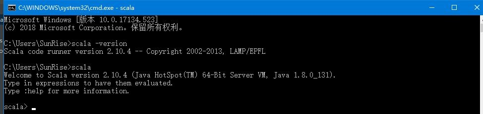
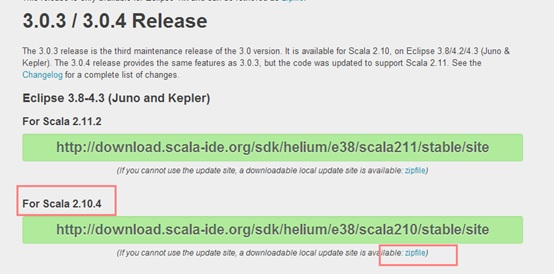
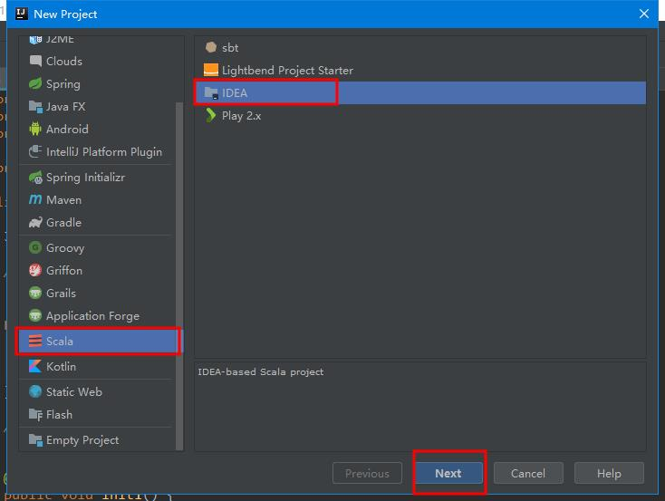
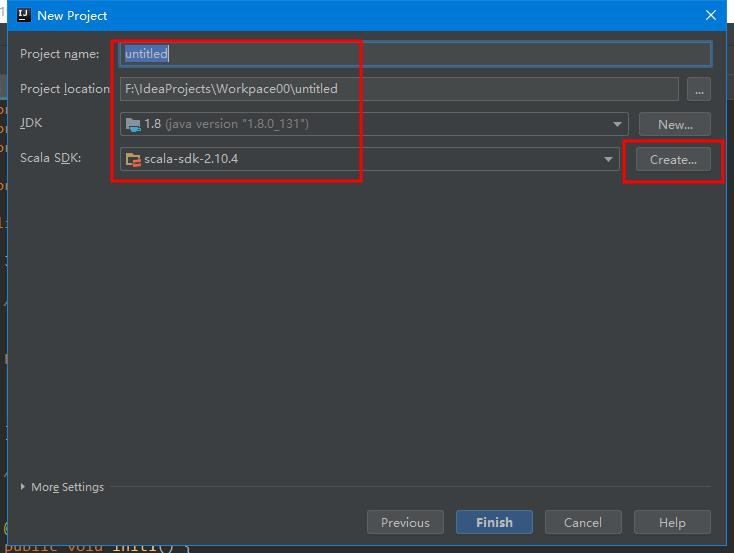
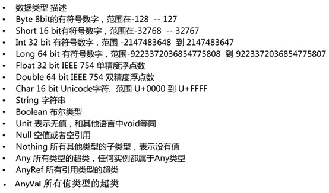
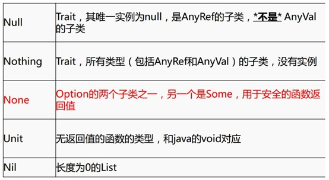
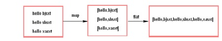

# 一、Scala官网6个特征。

## 简捷，快速 

## 1、Java

* 与Java无缝整合，运行在JVM上，编译形成.class文件

## 2、类型

* 类型自动推断:var 变量类型   val 常量类型  
   （var  s = 1 自动推断s 为int类型 ）
    dos窗口运行Scala语言（cmd  - >scala）  

## 3、并发

* 底层有actor，天生用于高并发和分布式

## 4、继承

* trait 特征特质（Java中接口和抽象类的结合体？？？两者区别？？单继承多实现） 
  ​    静态语言  （Java静态语言  shell 、Python动态语言）

## 5、匹配

* 模式匹配:(Java中的switch case类型必须一致)可匹配多种类型

## 6、高阶

* 高阶函数（函数式编程）函数可以作为参数传入方法中（Jdk 8 stream流，莱姆塔表达式）

​       工具类中方法为静态的

# 二、Scala安装

## 1、windows安装,配置环境变量

Ø  官网下载scala2.10：（因为spark需要的是这个版本的Scala）

<http://www.scala-lang.org/download/2.10.4.html> 

Ø  下载好后安装。双击msi包安装,记住安装的路径。

Ø  配置环境变量（和配置jdk一样）

*  新建SCALA_HOME

* 编辑Path变量，在后面追加如下：

  ```
  ;%SCALA_HOME%\bin
  ```

Ø  打开cmd,输入：

```
scala  - version 
```


看是否显示版本号，确定是否安装成功




## 2、eclipse 配置scala插件

Ø  下载插件（一定要对应eclipse版本下载）,并解压

<http://scala-ide.org/download/prev-stable.html>



Ø  将解压目录下的features和plugins两个文件夹拷贝到eclipse安装目录中的”dropins/scala”目录下。

进入dropins，新建scala文件夹，将两个文件夹拷贝到“dropins/scala”下


## 3、Scala编辑器：scala ide  

下载网址：<http://scala-ide.org/download/sdk.html> 

## 4、Idea 中配置scala插件

Ø  打开idea,close项目后，点击Configure->Plugins

Ø  搜索scala，点击Install安装

Ø  设置jdk，打开Project Structure,点击new 选择安装好的jdk路径

Ø 新建Scala项目





# 三、Scala基础语法

## 1、数据类型






## **2**、**变量和常量的声明**

```scala
    /**
     * 定义变量和常量
     * 变量 :用 var 定义 ，可修改 
     * 常量 :用 val 定义，不可修改
     */
    var name = "zhangsan"
    println(name)
    name ="lisi"
    println(name)
    val gender = "m"
//    gender = "m"//错误，不能给常量再赋值
// 定义变量或者常量的时候，也可以写上返回的类型，一般省略，如：val a:Int = 10
```

## **3、**类和对象

Ø  创建类

```scala
class Person{
  val name = "zhangsan"
  val age = 18
  def sayName() = {
    "my name is "+ name
  }
}
```

Ø  创建对象

```scala
object Lesson_Class {
   def main(args: Array[String]): Unit = {
    val person = new Person()
    println(person.age);
    println(person.sayName())
  }
}
```

Ø  伴生类和伴生对象

```scala
class Person(xname :String , xage :Int){
  var name = Person.name
  val age = xage
  var gender = "m"
  def this(name:String,age:Int,g:String){
    this(name,age)
    gender = g
  }
  
  def sayName() = {
    "my name is "+ name
  }

}

object Person {
  val name = "zhangsanfeng"
  
  def main(args: Array[String]): Unit = {
    val person = new Person("wagnwu",10,"f")
    println(person.age);
    println(person.sayName())
    println(person.gender)
  }
}

```


`注意`

> * 建议类名首字母大写 ，方法首字母小写，类和方法命名建议符合驼峰命名法。
> * .一行结束，不需要分号。如果一行里有多个语句，则之间用分号隔开。
> * scala 中的object是单例对象，相当于java中的工具类，它里面的方法可以看成都是static静态的。object不可以传参数。另：Trait不可以传参数
> * scala中的class类默认可以传参数，默认的传参数就是默认的构造函数。
>
>   重写构造函数的时候，必须要先调用默认的构造函数。
>
> *  class 类属性自带getter ，setter方法。
> *  使用object时，不用new，使用class时要new ,并且new的时候，class中除了方法不执行，其他都执行。
> *  如果在同一个文件中，object对象和class类的名称相同，则这个对象就是这个类的伴生对象，class称为object对象的伴生类，object 称为class类的伴生对象，他们可以直接访问对方的私有变量。


## **3.**  **if else** 

```scala
    /**
     * if else 
     */
    val age =18 
    if (age < 18 ){
    	println("no allow")
    }else if (18<=age&&age<=20){
    	println("allow with other")
    }else{
    	println("allow self")
    }
```

## **4.**   for ,while,do…while

*  to和until 的用法（不带步长，带步长区别）

```scala
  /**        
  * to和until        
  * 例：        
  * 1 to 10 返回1到10的Range数组，包含10        
  * 1 until 10 返回1到10 Range数组 ，不包含10        
  */              
println(1 to 10 )//打印： Range(1, 2, 3, 4, 5, 6, 7, 8, 9, 10)      
println(1.to(10))//同上

println(1 to (10 ,2))//步长为2，从1开始打印： Range(1, 3, 5, 7, 9)      
println(1.to(10, 2)) //同上

println(1 until 10 ) //不包含最后一个数，打印1,2,3,4,5,6,7,8,9     
println(1.until(10))//同上          
println(1 until (10 ,3 ))//步长为2，从1开始打印，打印1,4,7       
```

*  创建for循环

```scala
   /**
     * for 循环
     * 
     */
    for( i <- 1 to 10 ){
      println(i)
    }
```

* 创建多层for循环

```scala
//可以分号隔开，写入多个list赋值的变量，构成多层for循环
    //scala中 不能写count++ count-- 只能写count+
    var count = 0;
    for(i <- 1 to 10; j <- 1 until 10){
      println("i="+ i +",	j="+j)
      count += 1
    }
    println(count);
 //例子： 打印小九九
    for(i <- 1 until 10 ;j <- 1 until 10){
      if(i>=j){
    	  print(i +" * " + j + " = "+ i*j+"	")        
      }
      if(i==j ){
        println()
      }      
    }
//九九乘法表
     //方法一
//      for(i<- 1 to 9 ){
//        for (j <- 1 to i){
//          print(j+"*"+i+"="+i*j+"\t")
//        }
//        println()
//      }

    //方法二
//    for(i<- 1 to 9 ){
//      for (j<- 1 to 9){
//        if(j<=i){
//          print(j+"*"+i+"="+i*j+"\t")
//        }
//
//        if(i==j)println()
//      }
//    }

```

*  for循环中可以加条件判断，分号隔开

```scala
 //可以在for循环中加入条件判断
    for(i<- 1 to 10 ;if (i%2) == 0 ;if (i == 4) ){
      println(i)
}
```

* scala中不能使用count++，count只能使用count = count+1 ，count += 1

* while循环，while（）{}，do {}while()

```scala
 //将for中的符合条件的元素通过yield关键字返回成一个集合
    val list = for(i <- 1 to 10  ; if(i > 5 )) yield i 
//<-  后面是一个集合
    for( w <- list ){
      println(w)
}
   /**
     * while 循环
     */
    var index = 0 
    while(index < 100 ){
    	println("第"+index+"次while 循环")
      index += 1 
    }
 index = 0 
    do{
    	index +=1 
    	println("第"+index+"次do while 循环")
}while(index <100 )

```


# 四、Scala函数

## 1、函数定义

```scala
def fun (a: Int , b: Int ) : Unit = {
   println(a+b)
 }
fun(1,1)
    
def fun1 (a : Int , b : Int)= a+b
    println(fun1(1,2))  

```


`语法解释`

> * 函数定义语法 用def来定义
> * 可以定义传入的参数，要指定传入参数的类型
> * scala中函数中如果返回返回值类型为Unit ，即无返回值
>
> ```scala
> def add(x:Int=10,y:Int=11):Unit ={
>         x+y
>     }
> //写返回值类型是=时，一定要记得写 ：（冒号）
> ```
>
> * scala中函数有返回值时，可以写return，也可以不写return：
>
> * * 省略return的时候，函数自动回将最后一行的表达式的值，作为返回值
>
> ```scala
>  def max(x:Int,y:Int )={
>       if (x>y)
>           x
>       else
>          y
>     }
>  println(max(5,7))
> 结果显示：7
> ```
>
>     * * 如果函数有retrun,则必须写返回类型。
>
> ```scala
>   def min(m:Int,n:Int):Int={
>       if(m>n)
>         return n
>       else
>         return m
>     }
>     println(min(5,7))
> ```
>
>     * scala中函数有返回值时，可以写返回值的类型，也可以省略，因为scala可以类型自动推断，有时候不能省略，必须写，
>     * * 比如在递归函数中或者函数的返回值是函数类型的时候。
>
> ```scala
>  def num(x: Int): Int = {
>             if (x == 1)
>                 1
>             else {
>                 x * num(x - 1)
>             }
>         }
> ```
>
>
>
>     * 函数定义的时候，如果去掉 = ，那么这个方法返回类型必定是Unit的。
>        
>          这种说法无论方法体里面什么逻辑都成立，scala可以把任意类型转换为Unit。
>        
>          假设，里面的逻辑最后返回了一个string，那么这个返回值会被转换成Unit，并且值会被丢弃。
>        
>          则相当于，函数就将返回值去掉，即无返回值。
>        
>     * {}里的代码，如果只有一行，则可以省略{}
>        
>     *  传递给方法的参数可以在方法中使用，并且scala规定方法的传过来的参数为val类型，不能修改，不是var。


## 2、递归函数

```scala
 /**
     * 递归函数 
     * 5的阶乘
     */
    def fun2(num :Int) :Int= {
      if(num ==1)
        num
      else 
        num * fun2(num-1)
    }
    print(fun2(5))

```

## 3、**包含参数默认值的函数**

```scala
 /**
     * 包含默认参数值的函数
     * 注意：
     * 1.默认值的函数中，如果传入的参数个数与函数定义相同，则传入的数值会覆盖默认值
     * 2.如果不想覆盖默认值，传入的参数个数小于定义的函数的参数，则需要指定参数名称
     */
    def fun3(a :Int = 10,b:Int) = {
      println(a+b)
    }
    fun3(b=2)

```


## **4**、可变参数个数的函数

```scala

    /**
     * 可变参数个数的函数
     * 注意：多个参数逗号分开
     */
    def fun4(elem :Int*)={
      var sum = 0;
      for(e <- elem){
        sum += e
      }
      sum
    }
    println(fun4(1,2,3,4))

```

## **5、**匿名函数

* 有参匿名函数

*  无参匿名函数

*  有返回值的匿名函数

> 可以将匿名函数返回给val定义的值
>
> 匿名函数不能显式声明函数的返回类型

```scala

    //有参数匿名函数
    val fun1 = (a : Int ， b : Int) => {
      println(a+b)
    }
    value1(1,2)

    //无参数匿名函数
    val fun2 = ()=>{
      println("啦啦啦")
    }
    fun2()

    //有返回值的匿名函数
    val fun3 = (a:Int,b:Int) =>{
      a+b
    }
    println(fun3(4,4)) 

```

## **6、** **嵌套函数**

```scala
 /**
     * 嵌套函数
     * 例如：嵌套函数求5的阶乘
     */
    def fun5(num:Int)={
      def fun6(a:Int,b:Int):Int={
        if(a == 1){
          b
        }else{
          fun6(a-1,a*b)
        }
      }
      fun6(num,1)
    }
    println(fun5(5))

```

## **7、偏应用函数**

```scala
import java.util.Date
    /**
     * 偏应用函数是一种表达式
     * 不需要提供函数需要的所有参数，
     * 只需要提供部分，或不提供所需参数。
     */
    def log(date :Date, s :String)= {
      println("date is "+ date +",log is "+ s)
    }
    
    val date = new Date()
    log(date ,"log1")
    log(date ,"log2")
    log(date ,"log3")
    
    //想要调用log，以上变化的是第二个参数，可以用偏应用函数处理,来优化log方法
   /* 绑定第一个 date 参数，
    * 第二个参数使用下划线(_)替换缺失的参数列表，
    * 并把这个新的函数值的索引的赋给变量。
    */
    val logWithDate = log(date,_:String)
    logWithDate("log11")
    logWithDate("log22")
    logWithDate("log33")

```

## 8、**高阶函数**

```scala
    /**
     * 高阶函数:就是操作其他函数的函数
     * 函数的参数是函数		
     * 或者函数的返回是函数		
     * 或者函数的参数和返回都是函数
     */
//函数作为参数或者返回累心时，只需指明函数中的类型    
    //函数的参数是函数：
    //f : (Int,Int) =>Int  （两个Int型参数、Int型返回值）
    
    def hightFun(f : (Int,Int) =>Int, a:Int ) : Int = {
      f(a,100)
    }
    def f(v1 :Int,v2: Int):Int  = {
      v1+v2
    }  
    println(hightFun(f, 1))
          //***************
   def test1(x: Int, f: (Int, Int) => Int) = {
            var a = x + 100
            a * f(1, 3)
        }
   def sum(x: Int, y: Int): Int = {
            x - y
        }
     println(test6(10,sum))
//------------------------------------------------
    //函数的返回值类型为函数 ：(Int,Int)=>Int  f2
    //1，2,3,4相加
    def hightFun2(a : Int,b:Int) : (Int,Int)=>Int = {
      def f2 (v1: Int,v2:Int) :Int = {
        v1+v2+a+b
      }
      f2
    }
    println(hightFun2(1,2)(3,4))
            //***********
    def test2(x: Int): (Int) => String = {
            def concat(y: Int): String = {
                x + " !! " + y
            }
            concat
        }
    val concat: Int => String = test2(5)
    println(concat(7))
//        println(test2(5)(7))
 //-------------------------------------------------   
    //函数的参数是函数:  f : (Int ,Int) => Int)
    //函数的返回是函数:  (Int,Int) => Int
    def hightFun3(f : (Int ,Int) => Int) : (Int,Int) => Int = {
      f
    } 
    println(hightFun3(f)(100,200))
    println(hightFun3((a,b) =>{a+b})(200,200))
    //以上这句话还可以写成这样
    //如果函数的参数在方法体中只使用了一次 那么可以写成_表示
    println(hightFun3(_+_)(200,200))
            //**********
    def test3(y: Int, f: (Int) => Int): (Int) => Int = {
            var sum = f(1) + y
            def sum4(x: Int) = {
                x + sum
            }
            sum4
        }
//        def f2 (x: Int) ={
//            x + 10
//        }
        val f = test3(10,(x:Int)=>{x + 10})
//        println(f(5))

```

## 9、柯里化函数

```scala
 /**
     * 柯里化函数
     * 可以理解为高阶函数的简化
     */
    def fun1(a :Int,b:Int)(c:Int,d:Int) = {
      a+b+c+d
    }
    println(fun1(1,2)(3,4))
       //*******
   def fun(a :Int)(c:Int) = {
            a+c
        }
    println(fun(1)(3))

```

# 五、字符串

## 1、string  | stringBuilder (可变)

## 2、操作方法

Ø  比较:equals

Ø  比较忽略大小写:equalsIgnoreCase

Ø  indexOf：如果字符串中有传入的assci码对应的值，返回下标

```scala
    /**
     * String && StringBuilder
     */
    val str = "abcd"
    val str1 = "ABCD"
    
    println(str.indexOf(97))
    println(str.indexOf("b"))
    
    println(str==str1)
    println(str.equals(str1))
    println(str.equalsIgnoreCase(str1))
  
    /**
     * compareToIgnoreCase
     * 
     * 如果参数字符串等于此字符串，则返回值 0；
     * 如果此字符串小于字符串参数，则返回一个小于 0 的值；
     * 如果此字符串大于字符串参数，则返回一个大于 0 的值。
     * 
     */
    println(str.compareToIgnoreCase(str1))
    
    val strBuilder = new StringBuilder() //括号可省
    strBuilder.append("abc")
//一个 + 只能跟单个字符且必须用单引号，否则无效 
//    strBuilder.+('d')
    strBuilder+ 'd'
//    strBuilder.+=('h')
    strBuilder+= 'h' 

//两个+ 可跟多个字符且必须用双引号
//    strBuilder.++=("efg")
    strBuilder++= "efg"

//StringBuilder可以追加浮点数
    strBuilder.append(1.0)
    strBuilder.append(18f)
    println(strBuilder)
 println(strBuilder.toString())
```


# 六、集合

## 1、数组

### （1）创建一维数组

```scala
 /**
     * 创建数组两种方式：
     * 1.new Array[String](3)
     * 2.直接Array
     */
    
    //创建类型为Int 长度为3的数组
    val arr1 = new Array[Int](3)
    //创建String 类型的数组，直接赋值
    val arr2 = Array[String]("s100","s200","s300")
    //赋值
    arr1(0) = 100
    arr1(1) = 200
    arr1(2) = 300

```


### （2）数组遍历

```scala
   /**
     * 遍历两种方式
     * for
     * foreach
     */
    for(i <- arr1){
    	  println(i)
    }
    arr1.foreach(i => {
      println(i)
    })
    
    for(s <- arr2){
      println(s)
    }
    arr2.foreach { 
      x => println(x) 
    }

```


### （3）数组操作

```scala
Array.concat：合并数组
Array.fill(5)(“shsxt”)：创建初始值的定长数组


def main(args: Array[String]): Unit = {

        val a = new Array[Int](3)
        a(0) = 1
        a(1) = 2
        a(2) = 3

//判断数组中符合条件的元素的个数
//        val n = a.count(x=>{
//            if(x>2)
//                true
//            else
//                false
//        })
//
//        println(n)

        val b = Array(4,5,6)
//将两个数组的元素合并在一个新的数组中
        val ints = Array.concat(a,b)
//遍历数组
        ints.foreach(println)
//创建包含5个指定元素的数组
        val strings = Array.fill(5)("shsxt")
        strings.foreach(println)

//
//        for(i <- a){
//            println(i)
//        }
//
//        val b = Array(4,5,6)
//
//        for(i <- b){
//            println(i)
//        }


//        a.foreach(x=> { println(x) } )

//        a.foreach(println(_))

//         a.foreach(println)
//        val c = new Array[Array[Int]](3)
//        c(0) = Array(1,2,3)
//        c(1) = Array(4,5,6)
//        c(2) = Array(7,8,9)


//        c.foreach(x=>{
//            x.foreach(y=>{
//                print(y + "\t")
//            })
//            println()
//        })

//        for(i<-c){
//            for(j <-i){
//                print(j + "\t")
//            }
//            println()
//        }
    }
```


### （4）创建二维数组

```scala
  /**
     * 创建二维数组和遍历
     */
    val arr3 = new Array[Array[String]](3)
    arr3(0)=Array("1","2","3")
    arr3(1)=Array("4","5","6")
    arr3(2)=Array("7","8","9")
    for(i <- 0 until arr3.length){
      for(j <- 0 until arr3(i).length){
        print(arr3(i)(j)+"	")
      }
      println()
    }
    
    var count = 0
    for(arr <- arr3 ;i <- arr){
      if(count%3 == 0){
        println()
      }
      print(i+"	")
      count +=1 
    }
    
    arr3.foreach { arr  => {
      arr.foreach { println }
    }}
    
    val arr4 = Array[Array[Int]](Array(1,2,3),Array(4,5,6))
    arr4.foreach { arr => {
      arr.foreach(i => {
        println(i)
      })
    }}
    println("-------")
    for(arr <- arr4;i <- arr){
      println(i)

```


## 2、list

## （1）创建list

```scala
val list = List(1,2,3,4)
```

`备注`  Nil      长度为0的list

## （2）list遍历

> foreach ，for

## （3）list操作

```scala
  //创建
    val list = List(1,2,3,4,5)
    
    //遍历
    list.foreach { x => println(x)}
//    list.foreach { println}
    //filter 过滤元素
    val list1  = list.filter { x => x>3 }
    list1.foreach { println}
    
    //count  计算符合条件的元素个数
    val value = list1.count { x => x>3 }
    println(value)
    
    //map 对元素操作 如切分
    val nameList = List(
    		"hello shsxt",
    		"hello xasxt",
    		"hello shsxt"
        )
    val mapResult:List[Array[String]] = nameList.map{ 
        x => x.split(" ") 
    }
    mapResult.foreach{println}    
    
    //flatmap 将元素压扁平,先map再flat
    val flatMapResult : List[String] = nameList.flatMap{ x => x.split(" ") }
    flatMapResult.foreach { println }

```




## 3、set

`注意：`set集合自动去重

```scala
val s = Set(1,2,3,3)
val s1 = Set(1，2，3，4)

//遍历时，自动去重
s.foreach(println) 
for(x<- s){println(x)}

//交集
val inse = s.intersect(s1)
val ins = s.&(s1)
inse.foreach(println)
inse.foreach{println}

//差集
val di = s.diff(s1)
val de = s.&~(s1)

//子集:s是不是s1的子集
val boo: Boolean = s.subsetof(s1)

//max ,min
val max = s.max
val min = s.min
println(max + ":" + min)

//转成数组，list
s.toArray.foreach(println)
s.toList.foreach(println)

//mkString , 元素以！分隔拼成字符串
println(s.mkString)
println(s.mkstring("!"))

```

## 4、map

```scala
//map创建时，若key相同，则都会被后一个key覆盖
val map =Map（"1"->"a",("3","c"),"2"->"b"）

//获取map值
println(map.get("1"))
println(map.get("1").get)
//获取指定key，若没有，就用另一个指定值代替
println(map.getOrElse("5","100"))
val res = map.get("8").getOrElse("800")
println(res)

//遍历map
//x为map中的一组键值对
for(x-> map){
println("key:"+x._1+",value:"+ x._2) 
}
map.foreach(x=>{
 println("key:"+x._1+",value:"+ x._2)    
})
//遍历key
val keyIteratable = map.keys
keyIteratable.foreach(k=>{
println("key"+k+",value"+map.get(k).get)
})
//遍历value
val valueIteratable = map.values
valueIteratable.foreach{v=>{
    println("value"+v)
}}

//合并map
val map1 = Map（(1，"a"),(2,"b"),(3,"c")）
val map2 = Map（(1,"aa"),(2,"bb"),(3,"cc")）
map1.++(map2).foreach(println)
map1.++:(map2).oreach(println)

//map操作方法
//filter:过滤，留下符合条件的元素
val result = map.filter(x=>{
if(x._1.equals("1"))
    true
else
    false
})
result.foreach(println)
map.filter(_._2.equals("a")).foreach(println)
//count：统计符合条件的元素个数
val countResult = map.count（x=>{
      x._1.equals("1")
）
println(countResult)    
//contains：判断map中是否包含某个key
map.contains("3")
//exist：判断符合条件的元素是存在
//若遇到条件返回结果为true，就停止迭代
map.exists(x=>{
if（x._1.equals("3")){
println("存在喽")
}
else
println("不存在喽")
})
```

## 5、元组Tuple

同：与列表类似

不同：元组可以包含不同类型的元素；元组的值是通过将单个值包含在圆括号中构成

`注意：`Tuple最多支持22个参数

```scala
//元素个数取决于Tuple后面的数字
val t1 = new Tuple1(1)
val t2 = new Tuple2(1,2)
val t3 = Tuple3(1,2,3)  
val t5 = (1,2,3，4,5)
val t22 = new Tuple22(1,2,3,4,5,6,7,8,9,10,11,12,13,14,15,16,17,18,19,20,21,22)
//获取元组中的值 ：用  ._XX  
println（t5._4）

val t = Tuple2((1,2),("zhangsan","lisi"))
println(t._1._2)

//元组遍历：元素迭代器
val interator = t5.productorInterator
interator.foreach(println)
while(interator.hasNext){
    println(intrator.next())
}
//元素翻转 swap， 只针对二元数组
println(t2.swap)

//转换成字符串
println(t5.toString())
```


# 七、trait

Scala：只有extends  ，可以继承多个Trait

Scala Trait(特征) 相当于 Java 的接口和抽象类的结合

可以定义属性和方法

`注意：`

* 若继承的多个trait中包含同名的属性和方法，就必须在在类中使用`override` 重新定义
* 若重新定义的属性是使用`var`定义的则会报错，所以必须是使用`val`定义的属性才可使用override
* trait中不能传参数

`举例`：trait中带属性带方法实现

```scala
trait Read{
    var name = "read"
    val age = 18
    
    def read():Unit={
        println("read---")
    }

}
trait Write{
    var name = "write" 
    val age = 19
    def write():Unit={
        println("write----")
    }
}

class Human extends Read with Write{
  //前提name必须是用val定义的
  //  override var name  = "person"
    override val age = 20
    name  = "person"
}
object Trait{
    def main(args:Array[String]):Unit = {
        val human = new Human() 
        println(human.name)
        human.read()
        human.write()
        
    }
}
```

`举例`：trait中带方法不实现

```scala
trait Equal{
    //抽象方法
    def isEqual(p:Point):Boolean
    
    def isNoEqual(p:Point):Boolean={
        !isEqual(p)
    }
}

class Point(x:Int,y:Int) extends Equal {
    var xx = x
    var yy = y
    
    override def isEqual (p:Point) = {
       p.xx == xx & p.yy ==yy 
    }
    
    def isEqule(p:Any) = {
    p.isInstanceOf[Point] && p.asInstanceOf[Point].xx==xx
  }

}

object Trait2{
    def main(args:Array[String]):Unit = {
       val p1 = new Point(3,5)
       val p2 = new Point(4,5)
       ptintln(p1.isNoEqual(p2))
       ptintln(p1.isEqual(p2))
    }
}

```


# 八、模式匹配match

1、概念理解

* 一个模式匹配包含多个备选项，且每个都以关键字case开始
* 每个备选项都包含一个模式和多个表达式，且用箭头符号 => 隔开了模式和表达式。
* Ø 模式匹配不仅可以匹配值还可以匹配类型
* Ø  从上到下顺序匹配，如果匹配到则不再往下匹配
* Ø  都匹配不上时，会匹配到case_ ,相当于default
* Ø  match 的最外面的”{ }”可以去掉看成一个语句

```scala
object Match{
    def main(args:Array[String]):Unit = {
       val p1 =(1,2,3f,"4","abc",55d)
        p1.foreach(x=>{
            println(mymatch(x))
        })                
    }
    
    def mymatch(x:Any)={     
        x match {
            case "4" =>println("macth 4--")
            case x:String => println("match String")
            case 1 => println("1--")
            case 2 => println("2--")
            case 3f => println("3f--")
    //      case x :Double => println("type is Double")
            case _ => println("no match--")
            
        }
    }
}

```


# 九、样例类

1、概念理解

* 使用了case关键字的类定义就是样例类(case classes)

* 样例类是种特殊的类。实现了类构造参数的getter方法（构造参数默认被声明为val），当构造参数是声明为var类型的，它将帮你实现setter和getter方法。

  Ø  样例类默认帮你实现了toString,equals，copy和hashCode等方法。

  Ø  样例类可以new, 也可以不用new

2、举例：结合模式匹配的代码

```scala
object Match2{
    def main(args:Array[String]):Unit = {
    val zs = new Woman(18,"zs")
    println(zs.age + " : "+ zs . name) 
        
    val mm = Woman(19,"meimei")
    val nn = Woman(19,"meimei")
    println(mm.equals(zs))
    println(mm.equals(nn))
    
    val wo = List(ls,mm)
    wo.foreach(x=>{
            x match {
                case x:Woman => println("match Woman--")
                case Woman(18,"ls") => println("ls")
                case Woman(19,"mm") => println("mm")
                case Woman(19,"zs") => println("zs")
            }
        })
        
    }
}
case class Woman (age:Int ,name:String)
```


# 十、**Actor Model**


\1.    概念理解

Actor Model是用来编写并行计算或分布式系统的高层次抽象（类似java中的Thread）让程序员不必为多线程模式下共享锁而烦恼,被用在Erlang 语言上, 高可用性99.9999999 % 一年只有31ms 宕机Actors将状态和行为封装在一个轻量的进程/线程中，但是不和其他Actors分享状态，每个Actors有自己的世界观，当需要和其他Actors交互时，通过发送事件和消息，发送是异步的，非堵塞的(fire-andforget)，发送消息后不必等另外Actors回复，也不必暂停，每个Actors有自己的消息队列，进来的消息按先来后到排列，这就有很好的并发策略和可伸缩性，可以建立性能很好的事件驱动系统。

Actor的特征：

Ø  ActorModel是消息传递模型,基本特征就是消息传递

Ø  消息发送是异步的，非阻塞的

Ø  消息一旦发送成功，不能修改

Ø  Actor之间传递时，自己决定决定去检查消息，而不是一直等待，是异步非阻塞的

什么是Akka

Akka 是一个用 Scala 编写的库，用于简化编写容错的、高可伸缩性的 Java 和Scala 的 Actor 模型应用，底层实现就是Actor,Akka是一个开发库和运行环境，可以用于构建高并发、分布式、可容错、事件驱动的基于JVM的应用。使构建高并发的分布式应用更加容易。

spark1.6版本之前，spark分布式节点之间的消息传递使用的就是Akka，底层也就是actor实现的。1.6之后使用的netty传输。

```scala
class MyActor extends Actor{
override def act():Unit={
    while(true){ receive {
        case "hello"=>println("hello")  
        case x:String => println("save String ="+ x)
        case x:Int => println("save Int")
        case _ => println("save default")

    }                 
}
}

object Actor{
    def main(args:Array[String]):Unit = {
    
    val actor = new MyActor()
        //启动
        actor.start()
        //发送消息
        actor ! "hello"
  }
}
```


```scala
case class Msg(actor)()
class WoActor() extends Actor{
    oevrride def act():Unit ={
          while(true){
            receive {
                case msg:Msg =>{
                    msg.mes //收到的消息
                    msg.actor //回复的消息
                    println("too")
                    msg.actor ! "hahaha"
                    
                }
            }
        } 
    }
}
class HuActor(wo:WoActor) extends Actor{
    
    oevrride def act():Unit ={
        while(true){
            receive {
                case "hello" =>{
                    println("too")
                    val msg = Msg(this,"rrr")
                    wo ! msg
                }               
                case "rrr" =>{
                    println("uuu")
                   val msg = Msg(this,"heheh")
                    wo ! msg
                }
            }
        } 
    }
}
object Actor2{
    def main(args:Array[String]):Unit = {
     val woman = new WoActor()
    val human = new HuActor(woman)
        
        human.start()
        woman.start()
        human ! "hello"        
  }
}
```


```scala
case class Message(actor:Actor,msg:Any)

class Actor1 extends Actor{
  def act(){
    while(true){
      receive{
        case  msg :Message => {
          println("i sava msg! = "+ msg.msg)
          
          msg.actor!"i love you too !"
          }
        case msg :String => println(msg)
        case  _ => println("default msg!")
      }
    }
  }
}

class Actor2(actor :Actor) extends Actor{
  actor ! Message(this,"i love you !")
	def act(){
		while(true){
			receive{
  			case msg :String => {
  			  if(msg.equals("i love you too !")){
  			    println(msg)
  			   actor! "could we have a date !"
  			  }
  			}
  			case  _ => println("default msg!")
			}
		}
	}
}

object Lesson_Actor2 {
  def main(args: Array[String]): Unit = {
    val actor1 = new Actor1()
    actor1.start()
    val actor2 = new Actor2(actor1)
    actor2.start()
  }
}

```


# 十一、WordCount

```scala
//在lib文件中添加spark的jar包 ，并addLib
import org.apache.spark.SparkConf
import org.apache.spark.SparkContext
import org.apache.spark.rdd.RDD
import org.apache.spark.rdd.RDD.rddToPairRDDFunctions

object WordCount {
  def main(args: Array[String]): Unit = {
      
    val conf = new SparkConf()
      
    conf.setMaster("local").setAppName("WC")
      
    val sc = new SparkContext(conf)  //用于了解集群
      
    //RDD:集合 ，抽象的
    val lines :RDD[String] = sc.textFile("./words.txt")
    
    //方式一：
    val word :RDD[String]  = lines.flatMap{lines => {
      lines.split(" ")  //匿名函数
    }}
      
    val pairs:RDD[(String,Int)] = word.map{ x => (x,1) }
      //map :一进一出    flatmap：一进多出    x：每个单词
      
    val result:RDD[(String,Int)] = pairs.reduceByKey{(a,b)=> {
        println("a:"+a+",b:"+b)
        a+b    //相当于  a = a + b用于下一个统计
    }}
      //优化：排序  false（降序）  第一个_ 代表每个元素
    result.sortBy(_._2,false).foreach(println)
    
    //方式二：简化写法
    lines.flatMap { _.split(" ")}.map { (_,1)}.reduceByKey(_+_).foreach(println)
    
  }
}

```

