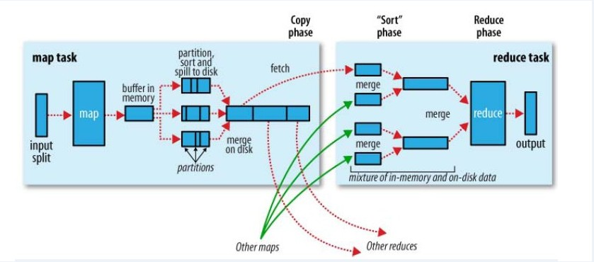
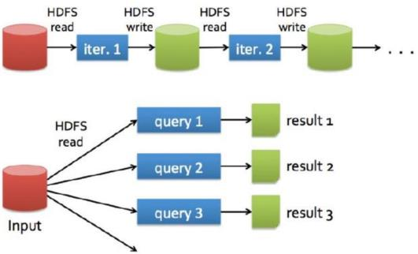
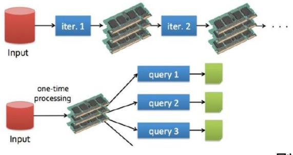
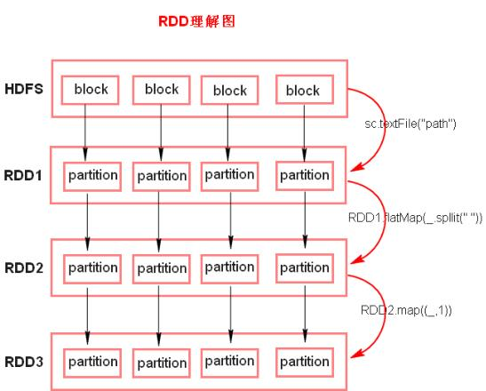
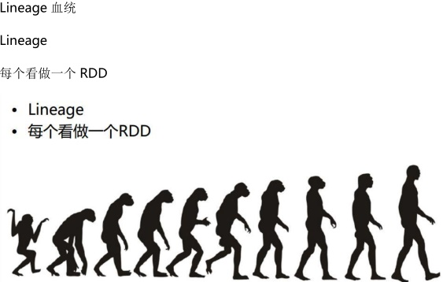
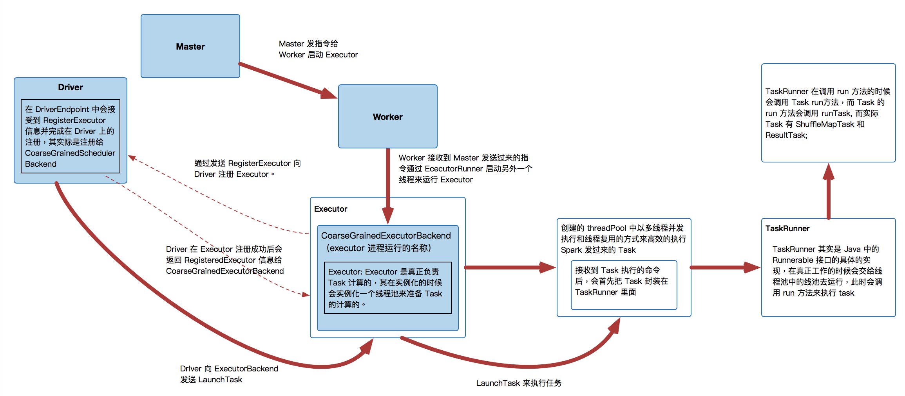
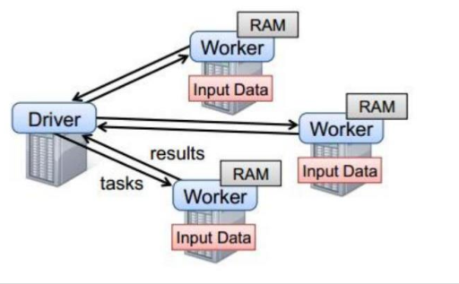

---

# 一、Spark简介

## 1、什么是Spark？

> Lightning-fast unified analytics engine
>
> Apache Spark 是专为大规模数据处理而设计的快速通用的计算引擎。

用于逻辑回归算法：

快速(100倍)：能更好的的适用于数据挖掘与机器学习等需要迭代的算法（在计算结果的基础上再计算）；Job的中间结果值在内存中流转，不需要读取HDFS，屏蔽磁盘开销；DAG调度

mr：离线，（迭代时：磁盘IO，较慢）

storm：流式

> Spark是用Scala编写的，方便快速编程


## 2、与MapReduce的区别

* MapReduce

<div align="center"></div>


<div align="center"></div>

* Spark

<div align="center"></div>

区别：

> 同：分布式计算框架
>
> 不同：
>
> * Spark基于内存，MR基于HDFS
> * Spark处理数据的能力是MR的十倍以上
> * Spark除了基于内存计算之外，还有DAG有向无环图来切分任务的执行顺序


Spark API  的使用语言

> Scala（很好）
> Python(不错)
> Java(…)


## 3、Spark运行模式

* local

多用于本地测试，如在 eclipse，idea 中写程序测试

* standalone

standalone是Spark自带的资源调度框架，它支持完全分布式

* yarn

Hadoop生态圈的资源调度框架，Spark也是可以基于yarn来计算的

> 基于yarn来进行资源调度，必须实现ApplicationMaster接口，Spark实现的这个接口，所以可以使用

* mesos

资源调度框架

# 二、Sparkcore

## 1、RDD 

### （1）概念：

RDD(Resilient Distributed Dateset)弹性分布式数据集

### （2）五大特性

> 1. RDD 是由一系列的 partition 组成的。
> 2. 函数是作用在每一个 partition（split）上的。
> 3. RDD 之间有一系列的依赖关系。
> 4. 分区器是作用在 K,V 格式的 RDD 上。
> 5. RDD 提供一系列最佳的计算位置。

> * `获取RDD的方式`
> * parallelize()
>
> > ```java
> > //Distribute a local Scala collection to form an RDD
> > JavaRDD<T> rdd = javaSparkContext.parallelize(List<T> list)；
> > JavaRDD<T> rdd = javaSparkContext.parallelize(List<T> list,int numSlices)；    
> >     
> > ```
>
> * parallelizePairs
>
> > ```java
> > //Distribute a local Scala collection to form an RDD
> > JavaPairRDD<K,V> rdd = 
> >      javaSparkContext.parallelizePairs(List<Tuple2<K, V>> list)；     
> > JavaPairRDD<K,V> rdd = 
> >      javaSparkContext.parallelizePairs(List<Tuple2<K, V>> list,int numSlices)；
> > ```
> >
> >
>
> * textFile(“./xx.txt”)   也可指定分区

### （3）RDD理解图

<div align="center"></div>


`理论注解`

>* RDD  实际上不存储数据，这里方便理解，暂时理解为存储数据。
>
>*  textFile 方法底层封装的是MR 读取文件的方式(先 split,再读取文件)，默认 split 大小是一个 block 大小。
>
>*  RDD 提供计算最佳位置，体现了数据本地化。体现了大数据中“计算移动数据不移动”的理念。
>
>❔  哪里体现 RDD 的分布式？
>
>👆  RDD 是由 Partition 组成，partition 是分布在不同节点上的。
>
>❔  哪里体现 RDD 的弹性（容错）？
>
> 👆 partition 数量，大小没有限制,默认和split（block）一致，体现了 RDD 的弹性。
> 👆 RDD 之间依赖关系，可以基于上一个 RDD 重新计算出 RDD。
>
>❔  什么是 K,V 格式的 RDD?
>
>👆 如果 RDD 里面存储的数据都是二元组对象，那么这个 RDD 我们就叫做 K,V 格式的 RDD。
>
>👆 MR有分区器（根据key值求hash，来决定数据存放在哪个分区中，所以分区器必须作用在K，V格式的RDD上）
>
>


<div align="center"></div>

## 2、Spark任务执行原理

<div align="center"></div>

<div align="center"></div>


Driver：（相当于ApplicationMaster）

Worker：（相当于NodeManager）

以上图中有四个机器节点，

Driver 和 Worker 是启动在节点上的进程，
运行在 JVM 中的进程。
 Driver 与集群节点之间有频繁的通信。
 Driver：任务的调度（监控任务、 负责任务(tasks)的分发和结果的回收）。如果 task
的计算结果非常大就不要回收了。会造成 oom。
 Worker 是 Standalone 资源调度框架里面资源管理的从节点。也是JVM 进程。
 Master 是 Standalone 资源调度框架里面资源管理的主节点。也是JVM 进程。

## 3、Spark代码流程

### `以用Scala编写WordCount为例`

1、创建 SparkConf 对象
 可以设置 Application name。
 可以设置运行模式及资源需求。

```scala
 val conf = new SparkConf()
        /**
          * 几种运行方式：
          *   1.本地运行
          *   2.yarn
          *   3.standalone
          *   4.mesos
          */
  conf.setMaster("local").setAppName("wc")
```

2、创建 SparkContext 对象

```scala
 val  context = new SparkContext(conf)
```

3、基于 Spark 的上下文创建一个 RDD，对 RDD 进行处理。

```scala
//获取文件中每一行数据的ADD
 val lineADD = context.textFile("./wc.txt")
//获取每一行数据按空格切分后的ADD
 val wordADD = lineADD.flatMap(x=>{x.split(" ")})
//获取每个单词加上,1 后的ADD（K,V格式）
 val KVADD = wordADD.map(x=>{(x,1)})
//获取将相同key的value相加后的ADD（K,V格式），相当于Tuple2
 val resultADD = KVADD.reduceByKey((x,y)=>{x+y})
//降序排序
 val sortADD = resultADD.sortBy(_._2,false)
```

4、应用程序中要有 Action 类算子来触发 Transformation 类算子执行。

```scala
sortADD.foreach(println)
```

5、关闭 Spark 上下文对象 SparkContext。

```scala
context.stop()
```


## 4、Transformations 转换算子

### （1）概念

Transformations 类算子是一类算子（函数）叫做转换算子，如map,flatMap,reduceByKey 等。Transformations 算子是延迟执行，也叫懒加载执行。

> 有action触发算子任务才能提交，才会执行runjob
>
> 算子必须作用在RDD上

### （2）Transformation 类算子

> :arrow_up_small: **filter**
> 过滤符合条件的记录数，true 保留，false 过滤掉。
>
> 🔼 **contains**
>
> 作为条件，是否包含，返回true|false


> :arrow_up_small:**map**
> 将一个 RDD 中的每个数据项，通过 map 中的函数映射变为一个新的元素。
> 特点：输入一条，输出一条数据。
>
> :black_joker: **mapToPair**   (Java)
>
> 将RDD（如lineRDD）转换成二元组
>
> 🃏 **mapValues**
>
> 操作（K,V）RDD中的value     返回Tuple2<>
>
> :arrow_up_small: **flatMap**
> 先 map 后 flat。与 map 类似，每个输入项可以映射为 0 到多个输出项。
>
> 🔼 **mapPartition**
>
> 与 map 类似，遍历的单位是每个 partition 上的数据。一进一出
>
> 🔼**mapPartitionWithIndex**
> 类似于 mapPartitions,除此之外还会携带分区的索引值。
>
> 🔼 **repartition**
>
> repartition（3）
>
> 增加或减少分区.会产生shuffle
>
> 🔼**coalesce**
>
> coalesce(3,false)
>
> 常用于减少分区，第二个参数决定减少分区时是否产生shuffle：true 为产生 shuffle，false 不产生 shuffle。默认是 `false`。
>
> 如果 coalesce 设置的分区数比原来的 RDD 的分区数还多的话，第二个参数设置为 `false` 不会起作用，
>
> 如果设置成 true，效果和 repartition 一样。即 
>
> repartition(numPartitions) = coalesce(numPartitions,true)


> :arrow_up_small:**sample**
> 随机抽样算子，根据传进去的小数按比例进行，有放回或者无放回的抽样。
>
> :arrow_up_small:**reduceByKey**
> 对于K，V格式的RDD，将key相同的RDD，对其value值根据相应的逻辑进行处理。
>
> 🔼**reduceByKeyAndWindow** (f1,f2,s1,s2)  
>
> 窗口函数
>
> :arrow_up_small:**sortByKey/sortBy**
> 作用在 K,V 格式的 RDD 上，对 key 进行升序或者降序排序。


> :arrow_up_small:**join / leftOuterJoin / rightOuterJoin / fullOuterJoin**
>
> join ：保留公共元素 （K,V）
>
> leftOutJoin ：保留左边的元素
>
> rightOutJoin ：保留右边元素
>
> fullOutJoin ：去重保留 （保留最大分区数）
>
> 作用在 K,V 格式的 RDD 上。根据 K 进行连接，对（K,V）join(K,W)返回（K,(V,W)）
>
> * join 后的分区数与父 RDD 分区数多的那一个相同 
>
> 🔼**union**
>
> 都保留 （保留总分区数）
>
> 合并两个数据集。两个数据集的类型要一致。
>
> * 返回新的 RDD 的分区数是合并 RDD 分区数的总和。
>
> 🔼**intersection**
>
> 取两个数据集的交集
>
> 🔼 **subtract**
>
> 取两个数据集的差集
>
> 🔼 **distinct**(map+reduceByKey+map)
>
> 去重


> 🔼 **cogroup**
>
> 当调用类型（K,V）和（K，W）的数据上时，返回一个数据集（K，（Iterable<V>,Iterable<W>））
>
> 🔼**groupByKey**
> 作用在 K，V 格式的 RDD 上。根据 Key 进行分组。返回（K，Iterable <V>）。


> 🔼**zip**
> 将两个 RDD 中的元素（KV 格式/非 KV 格式）变成一个 KV 格式的 RDD,两个 RDD 的个数必须相同。
>
> 🔼**zipWithIndex**
> 该函数将 RDD 中的元素和这个元素在 RDD 中的索引号（从 0 开始）组合成（K,V）对。
>
> 🔼


```scala
object WordCount {
  def main(args: Array[String]): Unit = {
      
    val conf = new SparkConf()
      
    conf.setMaster("local").setAppName("WC")
      
    val context = new SparkContext(conf)  //用于了解集群
      
    val linesRDD :RDD[String] = context.textFile("./words.txt")
      
//  lineRDD.filter(x=>{
//            x.contains("sh")
//        }).foreach(println)

//  lineRDD.sample(true,0.2).foreach(println)
     
//  lineRDD.map((_,1)).reduceByKey(_ + _).sortBy(_._2,false).foreach(println)

//  lineRDD.map((_,1)).sortByKey().foreach(println)
         
    val wordRDD :RDD[String]  = linesRDD.flatMap{lines => {
      lines.split(" ")  //匿名函数
    }}
      
    val KVRDD:RDD[(String,Int)] = wordRDD.map{ x => (x,1) }
 
      
    val result:RDD[(String,Int)] = KVRDD.reduceByKey{(a,b)=> {
        println("a:"+a+",b:"+b)
        a+b    
    }}
```

`补充`

```java
    val conf = new SparkConf()
      
    conf.setMaster("local").setAppName("WC")
      
    val context = new SparkContext(conf)  //用于了解集群
      
   //parallelizePairs

   //join
Optional.absent(0)
optional.isPresent()
optinal.get()
```


## 5、Action 行动算子

### （1）概念

Action 类算子也是一类算子（函数）叫做行动算子，如foreach,collect，count 等。

Transformations 类算子是延迟执行，Action 类算子是触发执行（立即）。

> 一个 application 应用程序中有几个 Action 类算子执行，就有几个 job 运行。

### （2）Action 类算子

> :arrow_up_small: **count**
> 返回数据集中的元素数。会在结果计算完成后回收到 Driver 端。
>
> 🔼**countByKey**
> 作用到 K,V 格式的 RDD 上，根据 Key 计数相同 Key 的数据集元素。
>
> 🔼**countByValue**
> 根据数据集每个元素相同的内容来计数。返回相同内容的元素对应的条数。
>
>
>
> :arrow_up_small: **take(n)**
> 返回一个包含数据集前 n 个元素的集合。
> :arrow_up_small: **first**
> first=take(1),返回数据集中的第一个元素
>
> 🔼 **collect**
> 将计算结果回收到 Driver 端。
>
> :arrow_up_small: **foreach**
> 循环遍历数据集中的每个元素，运行相应的逻辑。
>
> :arrow_up_small: **foreachPartition**
>
> 遍历的数据是每个 partition 的数据。所以传的参数为Iterator
>
> :arrow_up_small:**reduce**
> 根据聚合逻辑聚合数据集中的每个元素。

```scala
    val conf = new SparkConf()
    conf.setMaster("local").setAppName("transf")

    val context = new SparkContext(conf)

    val lineADD = context.textFile("./wc.txt")
    val wordADD = lineADD.flatMap(x=>{x.split(" ")})

   // println(wordADD.count())

//lineADD中数据回收
    val arr= lineADD.collect()
    arr.foreach(println)

//  val takes: Array[String] = lineRDD.take(5)
//  takes.foreach(println)

//  val str: String = lineRDD.first()
//  println(str)
```

## 6、控制算子

### （1）概念：

* 控制算子有三种，cache、persist、checkpoint
* 以上算子都可以将RDD 持久化，持久化的单位是 partition。
* cache 和 persist 都是懒 执行的。
* 必须有一个 action 类算子触发执行。
* cache 和 persist 算子的返回值可赋值给一个变量，在其他 job 中直接使用这个变量就是使用持久化的数据了
* checkpoint 算子不仅能将 RDD 持久化到磁盘，还能切断 RDD 之间的依赖关系（所有父RDD）。
* `错误：`rdd.cache().count() 返回的不是持久化的 RDD，而是一个数值了。

### （2）详解

> 1️⃣**​ cache**
> 默认将 RDD 的数据持久化到内存中。cache 是懒执行。
>
> * `注意`：
>
> chche () =persist()=persist(StorageLevel.Memory_Only)

> 2️⃣ **persist** 
>
> 支持指定持久化级别
>
> useOffHeap  使用堆外内存
>
> disk、memory、offheap、deserialized（不序列化）、replication（副本数，默认为1）
>
> 序列化：压缩数据（节省空间，使用数据时要反序列化，会额外消耗CPU性能）
>
> none 、disk_only、disk_only_2、memeory_only 、memeory_only _ser 、 memory_and_disk 、 memory_and_disk_2

> 3️⃣ **checkpoint**  
>
> checkpoint 将 RDD 持久化到磁盘，还可以切断 RDD 之间的依赖关系。
>
> * checkpoint 的执行原理：
>
> 1. 当 RDD 的 job 执行完毕后，会从 finalRDD 从后往前回溯。
> 2. 当回溯到某一个 RDD 调用了 checkpoint 方法，会对当前的RDD 做一个标记。
> 3. Spark 框架会自动启动一个新的 job，重新计算这个 RDD 的数据，将数据持久化到 HDFS 上。
>
> * 优化：
>
> 对 RDD 执行 checkpoint 之前，最好对这个 RDD 先执行cache，这样新启动的 job 只需要将内存中的数据拷贝到 HDFS上就可以，省去了重新计算这一步。

持久化级别：如下


```scala
val cocnf = new SparkConf()
conf.setMaster("local").setAppname("count")
val context = new SparkContext()

//设置CP在HDFS上的路径
context.setCheckPointDir("")

val lineADD = context.textFile("./countword.txt")
val time1 = System.currentTimeMillis()
val c =  lineADD.count()
val time2 = System.currentTimeMillis()
val t1 = time2 - time1

//做缓存(persisit（m_o）)
linelineADD = lineADD.cache()
//做持久化
lineADD.persisit(StorageLevel.memory_only)
//checkpoint 容错,最好还有cache
lineADD.checkpoint()

val time3 = System.currentTimeMillis()
val c =  lineADD.count()
val time4 = System.currentTimeMillis()
val t2 = time4 - time3

//t1 远大于 t2
```


## WordCount

### `以用Java编写为例`

```java
package com.shsxt.spark.java;

import org.apache.spark.SparkConf;
import org.apache.spark.api.java.JavaPairRDD;
import org.apache.spark.api.java.JavaRDD;
import org.apache.spark.api.java.JavaSparkContext;
import org.apache.spark.api.java.function.*;
import scala.Tuple2;

import java.util.Arrays;
import java.util.List;

public class WordCount {

    public static void main(String[] args) {


        SparkConf conf = new SparkConf();

        conf.setMaster("local").setAppName("wc");

        JavaSparkContext context = new JavaSparkContext(conf);

        JavaRDD<String> rdd = context.textFile("./wc.txt");


        long count = rdd.count();

        List<String> collect = rdd.collect();

        List<String> take = rdd.take(5);

        String first = rdd.first();

        JavaRDD<String> wordRDD = rdd.flatMap(new FlatMapFunction<String, String>() {
            @Override
            public Iterable<String> call(String line) throws Exception {

                String[] split = line.split(" ");

                List<String> list = Arrays.asList(split);

                return list;
            }
        });

//        wordRDD.map(new Function<String>() {
//            @Override
//            public String call(String v1) throws Exception {
//                return null;
//            }
//        })


        JavaPairRDD<String, Integer> pairRDD = wordRDD.mapToPair(new PairFunction<String, String, Integer>() {
            @Override
            public Tuple2<String, Integer> call(String word) throws Exception {
                return new Tuple2(word, 1);
            }
        });


        JavaPairRDD<String, Integer> resultRDD = pairRDD.reduceByKey(new Function2<Integer, Integer, Integer>() {
            @Override
            public Integer call(Integer v1, Integer v2) throws Exception {
                return v1 + v2;
            }
        });


        JavaPairRDD<Integer, String> reverseRDD = resultRDD.mapToPair(new PairFunction<Tuple2<String, Integer>, Integer, String>() {
            @Override
            public Tuple2<Integer, String> call(Tuple2<String, Integer> tuple2) throws Exception {

                return new Tuple2<>(tuple2._2, tuple2._1);
            }
        });

        JavaPairRDD<Integer, String> sortByKey = reverseRDD.sortByKey(false);

        JavaPairRDD<String, Integer> result = sortByKey.mapToPair(new PairFunction<Tuple2<Integer, String>, String, Integer>() {
            @Override
            public Tuple2<String, Integer> call(Tuple2<Integer, String> tuple2) throws Exception {
                return new Tuple2<>(tuple2._2, tuple2._1);

            }
        });

        result.foreach(new VoidFunction<Tuple2<String, Integer>>() {
            @Override
            public void call(Tuple2<String, Integer> tuple2) throws Exception {
                System.out.println(tuple2);
            }
        });

    }
}

```


Linx系统定时调度：

crontab

定时调度脚本文件

脚本文件中，编辑spark 提交命令

>  `注意：`  脚本文件中的命令必须写它的完整路径，否则找不到此命令


