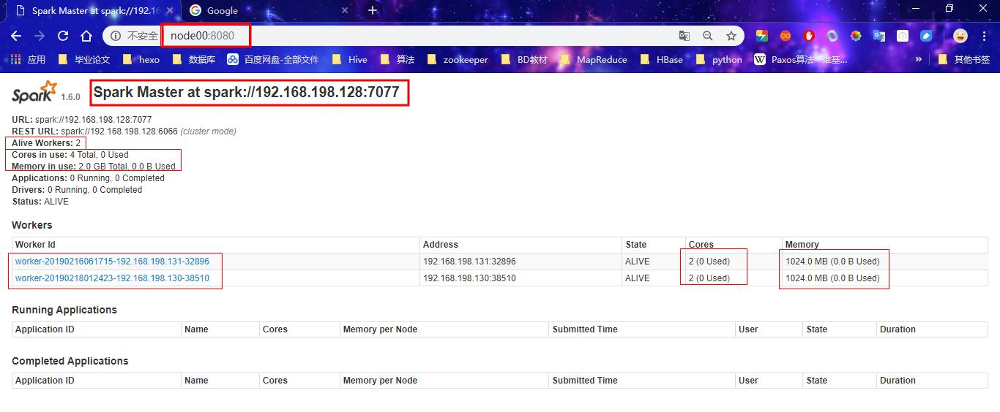

# 三、集群搭建及测试

## **Standalone**

### 1、下载安装包、解压

[Spark历史版本下载](https://archive.apache.org/dist/spark/)

`注意`： 与Hadoop的版本保持对应。

此处使用： [spark-1.6.0-bin-hadoop2.6.tgz](https://archive.apache.org/dist/spark/spark-1.6.0/spark-1.6.0-bin-hadoop2.6.tgz)

```shell
tar -zvxf spark-1.6.0-bin-hadoop2.6.tgz 
```

### 2、改名

```
mv spark-1.6.0-bin-hadoop2.6 spark-1.6.0
```

### 3、修改slaves

进入安装包的conf目录下，修改slaves.template文件，添加从节点。并保存。

```shell
#备份
cp slaves.template slaves
vim slaves
```

> 常驻进程：master、worker
>

配置slaves（与worker对应）

```sh
node2
node3
```

### 4、修改 spark-env.sh

改名（备份）

```
 cp spark-env.sh.template spark-env.sh
```

配置spark-env.sh（注意与虚拟机实际配置对应）

```sh
#locally
#cluster
#YARN client
#standalone deploy

#配置 java_home 路径
JAVA_HOME=/usr/soft/jdk1.8.0_191
#master 的 ip
SPARK_MASTER_IP=192.168.198.128
#提交任务的端口，默认是 7077
SPARK_MASTER_PORT=7077
#每个 worker 从节点能够支配的 core 的个数
SPARK_WORKER_CORES=1
#每个 worker 从节点能够支配的内存数
SPARK_WORKER_MEMORY=1024m
#配置yarn
HADOOP_CONF_DIR=/usr/soft/hadoop-2.6.5/etc/hadoop
```

### 5、其他节点

将spark解压文件发送到其他两个节点

```shell
[root@node00 soft]# scp -r  spark-1.6.0-bin-hadoop2.6 node2:`pwd`
[root@node00 soft]# scp -r  spark-1.6.0-bin-hadoop2.6 node3:`pwd`
```

6、配置环境变量（可不配，因为bin路径中包含start-all ，该命令与hdfs中的命令会冲突）

### 7、启动：(node1)

在spark的解压文件的/sbin 目录下

```shell
./start-all.sh
```

停止

```shell
./stop-all.sh
```


> 显示：
>
> [root@node00 sbin]# ./start-all.sh
> starting org.apache.spark.deploy.master.Master, logging to /usr/soft/spark-1.6.0-bin-hadoop2.6/logs/spark-root-org.apache.spark.deploymaster.Master-1-node00.out
>
> node01: starting org.apache.spark.deploy.worker.Worker, logging to /usr/soft/spark-1.6.0-bin-hadoop2.6/logs/spark-root-org.apache.spar.deploy.worker.Worker-1-node01.out
>
> node02: starting org.apache.spark.deploy.worker.Worker, logging to /usr/soft/spark-1.6.0-bin-hadoop2.6/logs/spark-root-org.apache.spar.deploy.worker.Worker-1-node02.out

查看三台节点的进程

node00（命令启动的节点）

> ```shell
> [root@node00 sbin]# jps
> ```
>
> 2343 Master
> 2408 Jps

nose01(配置的从节点)

> ```shell
> [root@node01 ~]# jps
> ```
>
>
> 2292 Jps
> 2229 Worker

node02(从节点)

> ```shell
> [root@node02 ~]# jps
> ```
>
> 6216 Worker
> 6266 Jps


`注意：`

> Worker在这里不是真正干活的进程，而是相当于Yarn中的NM。
>
> 它是负责管理所在节点资源的、向Master汇报所在节点的信息（如核数、内存数）
>
> Master： 监控任务、分发任务、回收计算结果 


### 8、搭建客户端

* 将 spark 安装包原封不动的拷贝到一个新的节点上，然后，在新的节点上提交任务即可。

`注意：`**8080** 是Spark WEBUI页面的端口 ； **7077** 是Spark任务提交的端口

web页面访问：ip:8080

* 修改master的WEBUI端口，

方法一（永久）：通过修改start-master.sh 文件（在/sbin目录下）

```shell
vim  start-master.sh
```

找到文件内容如下的部分：

```
if [ "$SPARK_MASTER_WEBUI_PORT" = "" ]; then
  SPARK_MASTER_WEBUI_PORT=8080
fi
```

方法二：在 Master 节点上导入临时环境变量，只作用于当前进程，重启就无效了。

```shell
[root@node00 sbin]# export SPARK_MASTER_WEBUI_PORT=8080
```

删除临时变量

```shell
[root@node00 sbin]# export -n SPARK_MASTER_WEBUI_PORT
```


<div align="center"></div>

## Yarn

### 1、步骤

**1。2。3。4。5。8。**同standalone

不用Master和Worker，所以不用第7步，我们使用的是yarn中的RM和NM

### 2、配置

添加 HADOOP_CONF_DIR配置

`（在使用Yarn时，就能找到关于hdfs的所有配置，其中就包括IP 和Port）`

方式一：

编辑spark-env.sh文件

方式二：

```shell
 export HADOOP_CONF_DIR=/usr/soft/hadoop-2.6.5/etc/hadoop
```


## 测试：求π值

Pi案例：

<div align="center"></div>

### **源码案例：**

路径：在spark解压路径spark-1.6.0-bin-hadoop2.6中

spark-1.6.0-bin-hadoop2.6/examples/src/main/scala/org/apache/spark/examples/SparkPi.scala

原理：随机产生无穷多个点落入如上图形中，求落入圆中的概率：
$$
概率   p = π*r*r/(2r*2r)=π
$$


```scala
/*
 * Licensed to the Apache Software Foundation (ASF) under one or more
 * contributor license agreements.  See the NOTICE file distributed with
 * this work for additional information regarding copyright ownership.
 * The ASF licenses this file to You under the Apache License, Version 2.0
 * (the "License"); you may not use this file except in compliance with
 * the License.  You may obtain a copy of the License at
 *
 *    http://www.apache.org/licenses/LICENSE-2.0
 *
 * Unless required by applicable law or agreed to in writing, software
 * distributed under the License is distributed on an "AS IS" BASIS,
 * WITHOUT WARRANTIES OR CONDITIONS OF ANY KIND, either express or implied.
 * See the License for the specific language governing permissions and
 * limitations under the License.
 */

// scalastyle:off println
package org.apache.spark.examples

import scala.math.random
import org.apache.spark._

/** Computes an approximation to pi */
object SparkPi {
  def main(args: Array[String]) {
    val conf = new SparkConf("local").setAppName("Spark Pi")
    val spark = new SparkContext(conf)
      
   // args 运行时传入的参数   slices 分区数量 (决定task数量)
    val slices = if (args.length > 0) args(0).toInt else 2
      
   //MaxValue 一个无限大的数   n   随机产生的十万个的数
    val n = math.min(100000L * slices, Int.MaxValue).toInt // avoid overflow
      
 //parallelize可以获得RDD  ，将1~n个数字放到RDD中
 //val count :[Int] = spark.parallelize(1 until n, slices)     
    val count = spark.parallelize(1 until n, slices).map { i =>
      val x = random * 2 - 1
      val y = random * 2 - 1
      if (x*x + y*y < 1) 1 else 0
    }.reduce(_ + _)
      
    println("Pi is roughly " + 4.0 * count / n)
    spark.stop()
  }
}
// scalastyle:on println

```


所需使用的jar包：spark-examples-1.6.0-hadoop2.6.0.jar

位置：解压目录的lib路径下


在任一节点的/bin路径下上执行如下命令：（node1）

### **Standalone** 提交命令:

```shell
./spark-submit    #提交spark 
--master spark://node3:7077   #spark主节点的地址和端口 
--class org.apache.spark.examples.SparkPi ../lib/spark-examples-1.6.0-hadoop2.6.0.jar 100   # 指明运行的jar包+路径 和 jar包中执行的包名+类名 100 为传入的参数

./spark-submit --master spark://node3:7077 --class org.apache.spark.examples.SparkPi ../lib/spark-examples-1.6.0-hadoop2.6.0.jar 100  
```

> `显示：`
>
> 提交命令的节点（node1主节点）
>
> 会显示执行日志、运算结果
>
> ```shell
> 19/02/13 23:27:31 INFO scheduler.TaskSetManager: Starting task 999.0 in stage 0.0 (TID 999, node02, partition 999,PROCESS_LOCAL, 2158 bytes)
> 19/02/13 23:27:31 INFO scheduler.TaskSetManager: Finished task 995.0 in stage 0.0 (TID 995) in 68 ms on node02 (996/1000)
> 19/02/13 23:27:31 INFO scheduler.TaskSetManager: Finished task 997.0 in stage 0.0 (TID 997) in 131 ms on node01 (997/1000)
> 19/02/13 23:27:31 INFO scheduler.TaskSetManager: Finished task 996.0 in stage 0.0 (TID 996) in 147 ms on node01 (998/1000)
> 19/02/13 23:27:31 INFO scheduler.TaskSetManager: Finished task 999.0 in stage 0.0 (TID 999) in 112 ms on node02 (999/1000)
> 19/02/13 23:27:31 INFO scheduler.TaskSetManager: Finished task 998.0 in stage 0.0 (TID 998) in 115 ms on node02 (1000/1000)
> 19/02/13 23:27:31 INFO scheduler.DAGScheduler: ResultStage 0 (reduce at SparkPi.scala:36) finished in 79.202 s
> 19/02/13 23:27:31 INFO scheduler.TaskSchedulerImpl: Removed TaskSet 0.0, whose tasks have all completed, from pool 
> 19/02/13 23:27:31 INFO scheduler.DAGScheduler: Job 0 finished: reduce at SparkPi.scala:36, took 82.641779 s
> 
> Pi is roughly 3.14148344      #运算结果
> 
> 19/02/13 23:27:32 INFO handler.ContextHandler: stopped o.s.j.s.ServletContextHandler{/metrics/json,null}
> 19/02/13 23:27:32 INFO handler.ContextHandler: stopped o.s.j.s.ServletContextHandler{/stages/stage/kill,null}
> 19/02/13 23:27:32 INFO handler.ContextHandler: stopped o.s.j.s.ServletContextHandler{/api,null}
> 。。。。。。。。。。。。。。。。。。。。。。。。。
> 19/02/13 23:27:32 INFO handler.ContextHandler: stopped o.s.j.s.ServletContextHandler{/jobs/json,null}
> 19/02/13 23:27:32 INFO handler.ContextHandler: stopped o.s.j.s.ServletContextHandler{/jobs,null}
> 19/02/13 23:27:32 INFO ui.SparkUI: Stopped Spark web UI at http://192.168.198.128:4040
> 19/02/13 23:27:32 INFO cluster.SparkDeploySchedulerBackend: Shutting down all executors
> 19/02/13 23:27:32 INFO cluster.SparkDeploySchedulerBackend: Asking each executor to shut down
> 19/02/13 23:27:32 INFO spark.MapOutputTrackerMasterEndpoint: MapOutputTrackerMasterEndpoint stopped!
> 19/02/13 23:27:33 INFO storage.MemoryStore: MemoryStore cleared
> 19/02/13 23:27:33 INFO storage.BlockManager: BlockManager stopped
> 19/02/13 23:27:33 INFO storage.BlockManagerMaster: BlockManagerMaster stopped
> 19/02/13 23:27:33 INFO scheduler.OutputCommitCoordinator$OutputCommitCoordinatorEndpoint: OutputCommitCoordinator stopped!
> 19/02/13 23:27:33 INFO remote.RemoteActorRefProvider$RemotingTerminator: Shutting down remote daemon.
> 19/02/13 23:27:33 INFO remote.RemoteActorRefProvider$RemotingTerminator: Remote daemon shut down; proceeding with flushing remote transports.
> 19/02/13 23:27:34 INFO spark.SparkContext: Successfully stopped SparkContext
> 19/02/13 23:27:34 INFO util.ShutdownHookManager: Shutdown hook called
> 19/02/13 23:27:34 INFO util.ShutdownHookManager: Deleting directory /tmp/spark-f7c2019e-10f4-4b31-9308-5a94603de113
> 19/02/13 23:27:35 INFO util.ShutdownHookManager: Deleting directory /tmp/spark-f7c2019e-10f4-4b31-9308-5a94603de113/httpd-39b8b4b3-9b80-4247-9c7e-ed6bd2dc389f
> 
> ```
>
> 在命令执行期间：
>
> 在三个节点敲如下命令：jps，会显示：
>
> node1：
>
> ```shell
> [root@node1 ~]# jps
> 4903 Jps
> 2343 Master
> 4764 SparkSubmit  #代表是提交spark的节点 (与主从无关)
> ```
>
> node2和node3：
>
> ```shell
> [root@node2 bin]# jps
> 2229 Worker
> 5096 CoarseGrainedExecutorBackend    #代表是干活的节点 （仅为从节点进程）
> 5167 Jps
> ```
>
> 如果提交命令的节点是从节点（node2），则在该节点上会显示执行日志、运算结果
>
> 则在提交过程中，敲命令：jps  该节点会显示
>
> ```shell
> [root@node2 ~]# jps
> 5298 CoarseGrainedExecutorBackend  #代表是干活的节点 （仅为从节点进程）
> 2229 Worker
> 5323 Jps
> 5213 SparkSubmit #代表是提交spark的节点 (与主从无关)
> 
> ```
>
>

### **YARN** 提交命令：

基于Hadoop ：

 

|       |  NN  |  DN  |  JN  | ZKFC |  ZK  |  RM  |  NM  | Master | slave |
| :---: | :--: | :--: | :--: | :--: | :--: | :--: | :--: | :----: | :---: |
| node1 |  √   |  √   |  √   |  √   |  √   |      |  √   |        |   √   |
| node2 |  √   |  √   |  √   |  √   |  √   |  √   |  √   |        |   √   |
| node3 |      |  √   |  √   |      |  √   |  √   |  √   |   √    |       |

启动zookeeper ：（3台）

```shell
zkServer.sh start
```

启动hdfs ：（1台）

```shell
start-all.sh     
```

相当于：Instead use start-dfs.sh and start-yarn.sh

启动resourcemanager ：(在RM的主节点上启动 ：1台)

```shell
yarn-daemon.sh start resourcemanager
```

在任一节点的/bin路径下执行：（node01）

```shell
./spark-submit
--master yarn #HADOOP_CONF_DIR配置使得在使用Yarn时能找到hdfs的所有配置，其中就有IP 和Port
--class org.apache.spark.examples.SparkPi ../lib/spark-examples-1.6.0-hadoop2.6.0.jar 100

./spark-submit --master yarn --class org.apache.spark.examples.SparkPi ../lib/spark-examples-1.6.0-hadoop2.6.0.jar 1000
```

`显示`

> * 执行日志、计算结果会在执行提交命令的节点上显示
>
> * 在命令提交过程中在三台节点上敲命令：jps 会显示
>
> node02：
>
> [root@node02 ~]# jps
> 3406 DataNode
> 3491 JournalNode
> 1681 QuorumPeerMain
> 4133 CoarseGrainedExecutorBackend    # 真正干活的进程
> 4092 ExecutorLauncher     # 启动executor
> 3585 NodeManager
> 3942 SparkSubmit     #提交spark的进程
> 4217 Jps

# 四、Standalone 模式两种提交任务方式

## 1、Standalone-client 提交任务方式

### (1)命令提交

* 在/sbin路径下：

```shell
./start-all.sh
```

* 提交spark

方式一：

```shell
./spark-submit
--master spark://node00:7077
--class org.apache.spark.examples.SparkPi
../lib/spark-examples-1.6.0-hadoop2.6.0.jar
1000
```

方式二：

```shell
./spark-submit
--master spark://node1:7077
--deploy-mode client
--class org.apache.spark.examples.SparkPi
../lib/spark-examples-1.6.0-hadoop2.6.0.jar
1000
```

### (2)执行原理图


### (3)执行流程


> 1. client 模式提交任务后，会在客户端启动 Driver 进程。
> 2. Driver 会向 Master 申请启动 Application 启动的资源。
> 3. 资源申请成功，Driver 端将 task 发送到 worker 端执行。
> 4. worker 将 task 执行结果返回到 Driver 端


### (4)总结

> * client 模式适用于测试调试程序。
>
> * Driver 进程是在客户端启动的，这里的客户端就是指提交应用程序的当前节点。
> * 在 Driver 端可以看到 task 执行的情况。生产环境下不能使用 client 模式，
>
> `是因为`：
>
> 假设要提交 100 个 application 到集群运行，Driver 每次都会在client 端启动，那么就会导致客户端 100 次网卡流量暴增的问题。

## 2、Standalone-cluster 提交任务方式

### （1）命令提交

* 在/sbin路径下：

```shell
./start-all.sh
```

* 提交spark

```shell
./spark-submit
--master spark://node00:7077
--deploy-mode cluster
--class org.apache.spark.examples.SparkPi
../lib/spark-examples-1.6.0-hadoop2.6.0.jar
1000
```

`注意：`

> Standalone-cluster 提交方式，应用程序使用的所有 jar 包和文件，必须保证所有的 worker 节点都要有，因为此种方式，spark 不会自动上传jar包。
>
> Standalone-client 和yarn 模式会在提交命令的时候自动uploading  实现jar包共享，
>
> 解决方式：
>
> 1、将所有的依赖包和文件各放一份在 worker 节点上。
>
> 2、将所有的依赖包和文件打到同一个包中，然后放在 hdfs 上。(路径需指定为hdfs上的路径)
>
> > ```shell
> > ./spark-submit
> > --master spark://node00:7077
> > --deploy-mode cluster
> > --class org.apache.spark.examples.SparkPi
> > hdfs://Sunrise/lib/spark-examples-1.6.0-hadoop2.6.0.jar
> > 1000
> > ```

### （2）执行原理图


### （3）执行流程

> 1. cluster 模式提交应用程序后，会向 Master 请求启动 Driver.
> 2. Master 接受请求，随机在集群一台节点启动 Driver 进程。
> 3. Driver 启动后为当前的应用程序申请资源。
> 4. Driver 端发送 task 到 worker 节点上执行。
> 5. worker 将执行情况和执行结果返回给 Driver 端。


### （4）总结

> Driver 进程是在集群某一台 Worker 上启动的，在客户端是无法查看 task 的执行情况的。假设要提交 100
> 个 application 到集群运行,每次 Driver 会随机在集群中某一台 Worker 上启动，那么这 100 次网卡流量暴
> 增的问题就散布在集群上


## 总结 Standalone

Standalone  两种方式提交任务，Driver  与集群的通信包括：

> 1. Driver 负责应用程序资源的申请
> 2. 任务的分发。
> 3. 结果的回收。
> 4. 监控 task 执行情况。


# 五、Yarn  模式两种提交任务方式

## 1、yarn-client 提交任务方式

### （1）命令提交

* 提交spark

方式一：

```shell
./spark-submit
--master yarn
--class org.apache.spark.examples.SparkPi 
../lib/spark-examples-1.6.0-hadoop2.6.0.jar
100
```

方式二：

```shell
./spark-submit
--master yarn–client
--class org.apache.spark.examples.SparkPi 
../lib/spark-examples-1.6.0-hadoop2.6.0.jar
100
```

方式三：

```shell
./spark-submit
--master yarn
--deploy-mode client
--class
org.apache.spark.examples.SparkPi ../lib/spark-examples-1.6.0-hadoop2.6.0.jar
100
```


### （2）执行原理图


### （3）执行流程

> 1. 客户端提交一个 Application，在客户端启动一个 Driver 进程。
> 2. 应用程序启动后会向 RS(ResourceManager)发送请求，启动AM(ApplicationMaster)的资源。
> 3. RS 收到请求，随机选择一台 NM(NodeManager)启动 AM。这里的 NM 相当于 Standalone 中的Worker 节点。
> 4. AM启动后，会向RS请求一批container资源，用于启动Executor.
> 5. RS 会找到一批 NM 返回给 AM,用于启动 Executor。
> 6. AM 会向 NM 发送命令启动 Executor。
> 7. Executor 启动后，会反向注册给 Driver，Driver 发送 task 到Executor,执行情况和结果返回给 Driver 端。

### （4）总结

> Yarn-client 模式同样是适用于测试，因为 Driver 运行在本地，Driver会与 yarn 集群中的 Executor 进行大量的通信，会造成客户机网卡流量的大量增加.


> * ApplicationMaster  的作用：
>
> 1. 为当前的 Application 申请资源
> 2. 给 NodeManager 发送消息启动 Executor。
>
>
>
> * 注意：
>
> ApplicationMaster 有 launchExecutor 和申请资源的功能，并没有作业调度的功能

## 2、yarn-cluster 提交任务方式

### （1）命令提交

* 提交spark

方式一：

```shell
./spark-submit
--master yarn
--deploy-mode cluster
--class
org.apache.spark.examples.SparkPi ../lib/spark-examples-1.6.0-hadoop2.6.0.jar
1000
```

方式二:

```shell
./spark-submit
--master yarn-cluster
--class
org.apache.spark.examples.SparkPi ../lib/spark-examples-1.6.0-hadoop2.6.0.jar
1000
```


### （2）执行原理图


### （3）执行流程

> 1. 客户机提交 Application 应用程序，发送请求到RS(ResourceManager),请求启动AM(ApplicationMaster)。
> 2. RS 收到请求后随机在一台 NM(NodeManager)上启动 AM（相当于 Driver 端）。
> 3. AM 启动，AM 发送请求到 RS，请求一批 container 用于启动Excutor。
> 4. RS 返回一批 NM 节点给 AM。
> 5. AM 连接到 NM,发送请求到 NM 启动 Excutor。
> 6. Excutor 反向注册到 AM 所在的节点的 Driver。Driver 发送 task到 Excutor。

### （4）总结

> Yarn-Cluster 主要用于生产环境中，
>
> 因为 Driver 运行在 Yarn 集群中某一台 nodeManager 中，每次提交任务的 Driver 所在的机器都是
> 随机的，不会产生某一台机器网卡流量激增的现象，
>
> 缺点是任务提交后不能看到日志。只能通过 yarn 查看日志。


> * ApplicationMaster  的作用：
>
> 1. 为当前的 Application 申请资源
> 2. 给 NodeManger 发送消息启动 Excutor。
> 3. 任务调度。
>
>
>
> * 停止集群任务命令：yarn application -kill applicationID

## 总结yarn

# 六、术语解释


# 七、宽窄依赖

## 1、窄依赖

父RDD的一个partition对应子RDD**`一个`**partition

父RDD的多个partition对应子RDD**`一个`**partition

不会产生shuffle

```
map
flatmap
filter
union
```

## 2、宽依赖

父RDD的一个partition对应子RDD**`多个`**partition

会产生shuffle

会划分stage

```
reduceByKey
join
groupBy
```

  

# 八、stage

## 0、概念

（1）Spark任务会根据RDD之间的依赖关系，形成一个DAG有向无环图，DAG会提交给DAGScheduler，DAGScheduler会把DAG划分相互依赖的多个stage，划分依据就是RDD之间的宽窄依赖关系：遇到宽依赖就划分stage

（2）stage内有一组并行的task组成，这些task将以taskSet的格式提交给TaskScheduler运行

（2）task运行时，stage之间的关系可能并行，也可能串行

## 1、stage 切割规则

切割规则：从后往前，遇到宽依赖就切割 stage。


## 2、stage 计算模式

pipeline 管道计算模式,pipeline 只是一种计算思想、模式。


> * 数据在内存中流转
> * 数据一直在管道里面什么时候数据会落地？
>
> 1. 对 RDD 进行持久化(cache、persisit)。
> 2. shuffle write 的时候。

> * 什么决定task数
>
> Stage 的 的 task  并行度是由 stage 的最后一个RDD的分区数来决定的 （partition分区数决定task数）
>
> 同一个stage中的task计算逻辑可能不同

> *   如何改变 RDD  的分区数？
>
> 宽依赖可改分区数；（因为此时数据已落地到磁盘）
>
> textFile(“  ”,5)
>
> reduceByKey(_ +_ , 5)
>
> GroupByKey(4)

> * 测试验证 pipeline 计算模式
>
> `注意：`textFile(“./wc.txt”)是通过文件获得RDD，parallelize()是通过转换参数内容获得RDD
>
> ```scala
> val conf = new SparkConf()
> conf.setMaster("local").setAppName("pipeline");
> val sc = new SparkContext(conf)
> val rdd = sc.parallelize(Array(1,2,3,4))
> val rdd1 = rdd.map { x => {
>       println("map--------"+x)
>        x
>       }
> }
> val rdd2 = rdd1.filter { x => {
> println("fliter********"+x)
> true
> } }
> rdd2.collect().foreach(print+",") //1,2,3,4
> sc.stop()
> ```
>
> `显示：`
>
> map--------1
>
> fliter********1
>
> map--------2
>
> fliter********2
>
> map--------3
>
> fliter********3
>
> map--------4
>
> fliter********4

# 九、Spark  资源调度和任务调度


## 1、概念解释

* **DAGScheduler**是任务调度的高层调度器，是一个对象

>  DAGScheduler 的主要作用就是
>
> 将DAG 根据 RDD 之间的宽窄依赖关系划分为一个个的 Stage，然后将这些Stage 以 TaskSet 的形式提交给 TaskScheduler

* **TaskScheduler** 是任务调度的低层调度器

* **TaskSet** 其实就是一个集合，里面封装的就是一个个的 task 任务,也就是 stage 中的并行度 task 任务

Application→Job→Stage→Task

* **Spark推测执行机制**

> 如果有运行缓慢的task,那么TaskScheduler就会启动一个新的task（在不同节点的excutor上）来执行相同的处理逻辑，两个task中哪个task先执行结束，就以那个task的执行结果为准。
>
> 在 Spark 中推测执行默认是关闭的。
>
> 推测执行可以通过 spark.speculation 属性来配置。
> `注意：`
>
> * 对于 ETL 类型要入数据库的业务要关闭推测执行机制，这样就不会有重复的数据入库。
>
> * 如果遇到数据倾斜的情况，开启推测执行则有可能导致一直会有task重新启动处理相同的逻辑，任务可能一直处于处理不完的状态。（这时候task慢是因为数据量过多，而不是执行性能不行）


## 2、Spark 资源调度和任务调度的流程：

> 1、启动集群后，Worker 节点会向 Master 节点汇报资源情况，Master 掌握了集群资源情况。
>
> 2、当 Spark 提交一个 Application 后，根据 RDD 之间依赖关系将 Application 形成一个 DAG 有向无环图。
>
> 3、任务提交后，Spark 会在Driver 端创建两个对象：DAGScheduler 和 TaskScheduler，
>
> DAGScheduler 将DAG 根据 RDD 之间的宽窄依赖关系划分为一个个的 Stage，然后将这些Stage 以 TaskSet 的形式提交给 TaskScheduler，
>
> TaskSchedule 会遍历TaskSet 集合，拿到每个 task 后会将 task 发送到计算节点 Executor 中去执行（其实就是发送到 Executor 中的线程池 ThreadPool 去执行）。
>
> task 在Executor 线程池中的运行情况会向 TaskScheduler 反馈，当 task 执行失败时，则由 TaskScheduler 负责重试，将 task 重新发送给 Executor 去执行，默认重试 3 次。如果重试 3 次依然失败，那么这个 task 所在的 stage 就失败了。
>
> stage 失败了则由 DAGScheduler 来负责重试，重新发送 TaskSet 到TaskSchdeuler，Stage 默认重试 4 次。如果重试 4 次以后依然失败，那么这个 job 就失败了。job 失败了，Application 就失败了。
>
> TaskScheduler 不仅能重试失败的 task,还会重试 straggling*<落后，缓慢的>*task（也就是执行速度比其他 task 慢太多的 task）。如果有运行缓慢的 task那么 TaskScheduler 会启动Spark 的推测执行机制先执行完，task 的执行结果为准。


## 3、资源调度和任务调度的流程图


## 4、粗粒度资源申请和细粒度资源申请

* **粗粒度资源申请**(Spark）
  在 Application 执行之前，将所有的资源申请完毕，当资源申请成功后，才会进行任务的调度，当所有的 task 执行完成后，才会释放这部分资源。

  > * **`优点：`**
  >
  >   在 Application 执行之前，所有的资源都申请完毕，每一个task 直接使用资源就可以了，不需要 task 在执行前自己去申请资源，task 启动就快了，task 执行快了，stage 执行就快了，job 就快了，application 执行就快了。
  >
  > * **`缺点：`**
  >
  >   直到最后一个 task 执行完成才会释放资源，集群的资源无法充分利用。

* **细粒度资源申请**
  Application 执行之前不需要先去申请资源，而是直接执行，让 job中的每一个 task 在执行前自己去申请资源，task 执行完成就释放资源。

  > **`优点`：**
  >
  > 集群的资源可以充分利用。
  >
  > **`缺点`**：
  >
  > task 自己去申请资源，task 启动变慢，Application 的运行就响应的变慢了。


