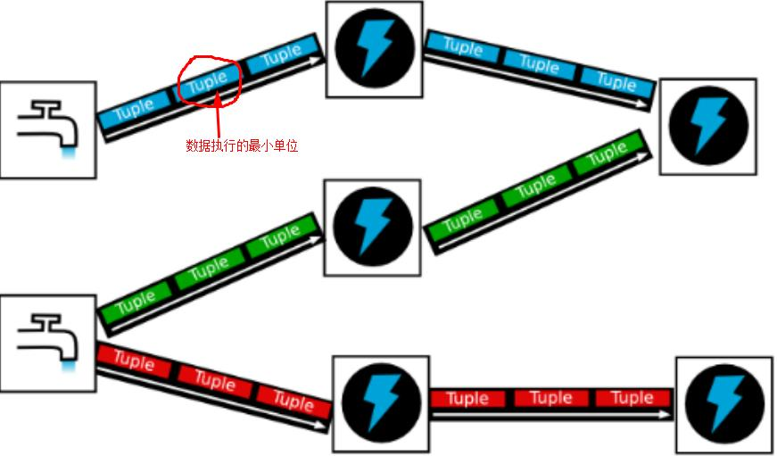

# 一、Storm简介

官网：[Storm]( http://storm.apache.org/)

## 1、Storm ：

流式计算处理框架

## 2、 特点：

* 实时

* 分布式

* 高容错

* storm常驻内存（7*24h:意味着永久运行，需人为关闭）

  * 在Web UI 界面点击kill

  * 命令kill

    ```
    bin/storm kill <topologyName>
    ```


* 数据不经过磁盘，在内存中处理
* 高可靠性：异常处理、消息可靠性保障机制
* 可维护性：StormUI图形化监控接口 

## 3、应用

（1）流式处理：（异步）

​     客户端提交数据进行计算，并不会等待计算结果

举例：

* 逐条处理：ETL（用于数据清洗）

* 统计分析

  * 例：计算PV、UV、访问热点 以及 某些数据的聚合、 加和、平均等等

    * 客户端提交数据以后，计算完成结果存储到redis 、 hbase 、 MySQL或其他MQ中

    * 客户端并不关心最终结果是多少


（2）实时请求应答服务：（同步）

   客户端提交数据后，等待取得计算结果并返回给客户端

Drpc机制

举例：


# 二、Storm架构

（从进程角度）


## 1、nimbus : (主)

接收客户端提交的请求；


资源调度、任务分配、接收jar包

## 2、supervisor：(从)

– 接收nimbus分配的任务、启停worker（当前supervisor上worker数量由配置文件设定）

– 默认配置4个work进程

## 3、worker

– 运行具体处理运算组件的进程（每个Worker对应执行一个Topology的子集）
– worker任务类型，即spout任务、bolt任务两种
– 启动executor
（executor即worker JVM进程中的一个java线程，一般默认每个executor负责执行一个task任务）

– 与_ack 个数一致

## 4、zookeeper

– 负责主从的通信

– 存储心跳信息、任务信息

– 实现主从的解耦，使nimbus对备份要求不高


# 三、Storm编程模型





## 1、**Topology**

（DAG有向无环图的实现）

> 是对Storm实时计算逻辑的封装，由一系列通过数据流相互关联的Spout、Bolt组成的拓扑结构

> 生命周期：
>
> 此拓扑结构只要启动，就会在集群中一直运行，直到手动将其kill，否则不会终止。
>
> （与MapReduce中Job的区别，MR中Job在计算完成后就会终止）


## 2、**spout**

（数据源：发送数据）

> 一般会从指定的数据源读取元祖（Tuple）发送到拓扑（Topology）中
>
> * 一个Spout可以发送多个Stream
>
>   （通过OutputFieldDeclare的declare方法声明不同的数据流，发送数据时通过SpoutOutputCollector中的emit方法指定 StreamId将数据发送出去）
>
> * Spout中的核心方法是nextTuple，该方法会被Storm线程不断调用、主动从数据源拉取数据、再通过emit方法将数据生成元祖（Tuple）发送给之后的Bolt计算

## 3、**bolt**

（数据处理组件：计算数据，个数不限）

> 单个Bolt可实现简单的任务或数据流转换
>
> 复杂的场景需要多个Bolt分多个步骤完成
>
> * 一个Bolt可以发送多个Stream
>
>   （通过OutputFieldDeclare的declare方法声明不同的数据流，发送数据时通过SpoutOutputCollector中的emit方法指定 StreamId将数据发送出去）
>
> * Bolt中的核心方法是execute，该方法通过接收一个元组数据、实现核心业务逻辑

## 4、**tuple**

（Stream中最小的数据组成单位）

## 5、**Stream**

（数据流）

> * 从Spout中传递数据给Bolt、上一个Bolt传递数据给下一个Bolt，这样形成的数据通道叫做Stream
>
> - Stream声明时需要给其指定Id（默认为Default，实际开发中多使用单一数据流，无需指定StreamId）

## 6、**Stream Grouping** 

– 数据流分组（即数据分发策略）

## 7、 数据传输

– ZMQ
​             – ZeroMQ 开源的消息传递框架，并不是一个MessageQueue
– Netty
​            – Netty是基于NIO的网络框架，更加高效。（之所以Storm 0.9版本之后使用Netty，是因为ZMQ的license和Storm的license不兼容。）

# 四、Storm安装部署

## 完全分布式

环境：zookeeper集群（node00，node01，node02）

1、解压安装

版本：apache-storm-0.10.0.tar.gz

```shell
tar -zvxf apache-storm-0.10.0.tar.gz
```

2、在storm目录中创建logs目录

```shell
mkdir logs
```

3、编辑配置文件解压路径/config/storm.yaml

```
storm.zookeeper.servers:
- "node00"
- "node01"
- "node02"
storm.local.dir: "/opt/storm"
nimbus.host: “node00"
supervisor.slots.ports:
- 6700
- 6701
- 6702
- 6703
```

将安装包发送到其他节点

4、启动服务

（1）启动zookeeper‘

```
zkServer.sh start
```

（2）启动nimbus（在node00上：storm安装目录下）

```
nohup ./bin/storm nimbus >> ./logs/nimbus.out 2>&1 &
```

`nohup`:防止被操作系统意外挂起

`2>&1`：标准错误输出重定向

`&`：后台运行

（3）启动supervisor（在node01 ，node02上：storm安装目录下）

```
./bin/storm supervisor>> ./logs/supervisor.out 2>&1 &
```

（4） 启动Logviewer

```shell
 ./bin/storm logviewer &
```

UI界面查看：

 查看日志：http://node00:8000/log?file=wc-1-1523947796-worker-6703.log

（5）查看进程 ：jps

显示：

node00：

> [root@node00 apache-storm-0.10.0]# jps
> 8869 QuorumPeerMain
> 9093 Jps
> 9083 config_value

node01 、 node02

> [root@node01 apache-storm-0.10.0]# jps
> 7280 config_value
> 7290 Jps
> 7230 QuorumPeerMain

且三个节点的logs目录下也相应的生成了指定的日志文件

5、Storm UI（从浏览器访问，在前台页面上查看详情）

（1）启动服务（可在node00节点：storm安装目录）

```shell
./bin/storm ui >> ./logs/ui.out 2>&1 &
```

（2）浏览器访问（Storm UI在哪台节点启动，就访问哪台节点）

> http://node00:8080

6、运行jar

```shell
##查看帮助
bin/storm -h
##查看指定命令的帮助
bin/storm  help jar
##运行jar包
bin/storm jar <jar包所在路径> <包名+类名> <参数：topologyName>
```


# 五、Storm重点概念详解

## 1、Storm Grouping -- 数据流分组（即数据分发策略）

• 1. Shuffle Grouping
– 随机分组，随机派发stream里面的tuple，保证每个bolt task接收到的tuple数目大致相同。
– 轮询，平均分配

• 2. Fields Grouping
– 按字段分组，比如，按"user-id"这个字段来分组，那么具有同样"user-id"的 tuple 会被分到相同的Bolt里的一个task， 而不同的"user-id"则可能会被分配到不同的task。

• 3. All Grouping
– 广播发送，对于每一个tuple，所有的bolts都会收到

• 4. Global Grouping
– 全局分组，把tuple分配给task id最低的task 。

```java
		TopologyBuilder builder = new TopologyBuilder();

		builder.setSpout("spout", new MySpout(), 2);
	  
//		 shuffleGrouping其实就是随机往下游去发,不自觉的做到了负载均衡
//		builder.setBolt("bolt", new MyBolt(),2).shuffleGrouping("spout");

		// fieldsGrouping其实就是MapReduce里面理解的Shuffle,根据fields求hash来取模
//      builder.setBolt("bolt", new MyBolt(), 2).fieldsGrouping("spout", new Fields("session_id"));

		// 只往一个里面发,往taskId小的那个里面去发送
		builder.setBolt("bolt", new MyBolt(), 2).globalGrouping("spout");

		// 等于shuffleGrouping
//		builder.setBolt("bolt", new MyBolt(), 2).noneGrouping("spout");

		// 广播下游的所有task都能收到数据
		builder.setBolt("bolt", new MyBolt(), 5).allGrouping("spout");

```

----------------------------------------------------------以上为常用grouping策略--------------------------------------------------------------

• 5. None Grouping
– 不分组，这个分组的意思是说stream不关心到底怎样分组。目前这种分组和Shuffle grouping是一样的效果。
有一点不同的是storm会把使用none grouping的这个bolt放到这个bolt的订阅者同一个线程里面去执行（未来Storm如果可能的话会这样设计）。

• 6. Direct Grouping（很少用）
– 指向型分组， 这是一种比较特别的分组方法，用这种分组意味着消息（tuple）的发送者指定由消息接收者的那个task处理这个消息。只有被声明为 Direct Stream 的消息流可以声明这种分组方法。而且这种消息tuple必须使用 emitDirect 方法来发射。消息处理者可以通过 TopologyContext 来获取处理它的消息的task的id
(OutputCollector.emit方法也会返回task的id)

• 7. Local or shuffle grouping
– 本地或随机分组。如果目标bolt有一个或者多个task与源bolt的task在同一个工作进程中，tuple将会被随机发送给这些同进程中的tasks。否则，和普通的Shuffle Grouping行为一致

• 8.customGrouping
– 自定义，相当于mapreduce那里自己去实现一个partition一样。

## 2、并发机制

### 1、 Worker processes

* Worker – 进程
  * 一个Topology拓扑会包含一个或多个Worker（每个Worker进程只能从属于一个特定的Topology）、
  * 这些Worker进程会并行跑在集群中不同的服务器上，即一个Topology拓扑其实是由并行运行在Storm集群中
    多台服务器上的进程所组成

### 2、Executors (threads)

*  Executor – 线程
  * Executor是由Worker进程中生成的一个线程
  * 每个Worker进程中会运行拓扑当中的一个或多个Executor线程
  * 一个Executor线程中可以执行一个或多个Task任务（默认每个Executor只执行一个Task任务），但是这些Task任务都是对应着同一个组件（Spout、Bolt）。

### 3、Task

*  Tasks – 任务
  * 实际执行数据处理的最小单元
  * 每个task即为一个Spout或者一个Bolt
  * Task数量在整个Topology生命周期中保持不变，Executor数量可以变化或手动调整
  * （默认情况下，Task数量和Executor是相同的，即每个Executor线程中默认运行一个Task任务）

### 4、 设置Worker进程数

```java
Config.setNumWorkers(int workers)
```

### 5、设置Executor线程数

```java
TopologyBuilder.setSpout(String id, IRichSpout spout, Number parallelism_hint)
TopologyBuilder.setBolt(String id, IRichBolt bolt, Number parallelism_hint)
//其中， parallelism_hint即为executor线程数
```


### 6、 设置Task数量

```java
ComponentConfigurationDeclarer.setNumTasks(Number val)
// 例：共2 worker ， 3 excutor ， 5  task
Config conf = new Config() ;
conf.setNumWorkers(2);//2 个work进程
TopologyBuilder topologyBuilder = new TopologyBuilder();
topologyBuilder.setSpout("spout", new MySpout(), 1);  // 1 个excutor线程 ， 1个 task
topologyBuilder.setBolt("green-bolt", new GreenBolt(), 2)  // 2 个excutor线程 ， 
.setNumTasks(4)   // 4  个task
.shuffleGrouping("blue-spout);
```

### 7、 Rebalance – 再平衡

– 即，动态调整Topology拓扑的Worker进程数量、以及Executor线程数量
• 支持两种调整方式：
– 1、通过Storm UI
– 2、通过Storm CLI

#### 通过Storm CLI动态调整：

– 例：

```shell
bin/storm rebalance mytopology -n 5 -e blue-spout=3 -e yellow-bolt=10
##将mytopology拓扑worker进程数量调整为5个
##“ blue-spout ” 所使用的线程数量调整为3个
##“ yellow-bolt ”所使用的线程数量调整为10个
```


## 3、通信机制 -- Worker内部的消息传递机制

#### • Worker进程间的数据通信

– ZMQ
– ZeroMQ 开源的消息传递框架，并不是一个MessageQueue
– Netty
– Netty是基于NIO的网络框架，更加高效。（之所以Storm 0.9版本之后使用Netty，是因为ZMQ的license和Storm的license不兼容。）

#### • Worker内部的数据通信

– Disruptor
– 实现了“队列”的功能。
– 可以理解为一种事件监听或者消息处理机制，即在队列当中一边由生产者放入消息数据，另一边消费者并行取出消息数据处理。

## 4、容错机制

###  1、集群节点宕机

– Nimbus服务器
• 单点故障？
– 非Nimbus服务器
• 故障时，该节点上所有Task任务都会超时，Nimbus会将这些Task任务重新分配到其他服务器上运行

###  2、进程挂掉

– Worker
• 挂掉时，Supervisor会重新启动这个进程。如果启动过程中仍然一直失败，并且无法向Nimbus发送心跳，Nimbus会将该Worker重新分配到其他服务器上

– Supervisor
• 无状态（所有的状态信息都存放在Zookeeper中来管理），不影响已经在运行的worker，但是在当前节点worker如果挂掉就无法重启，可以在另一台supervisor节点重启worker
• 快速失败（每当遇到任何异常情况，都会自动毁灭）

– Nimbus
• 无状态（所有的状态信息都存放在Zookeeper中来管理）
• 快速失败（每当遇到任何异常情况，都会自动毁灭）

###  3、消息的完整性

– 从Spout中发出的Tuple，以及基于他所产生Tuple（例如上个例子当中Spout发出的句子，以及句子当中单词的tuple等）
– 由这些消息就构成了一棵tuple树
– 当这棵tuple树发送完成，并且树当中每一条消息都被正确处理，就表明spout发送消息被“完整处理”，即消息的完整性

### 4、 Acker -- 消息完整性的实现机制

给每条数据添加唯一标记ID ， 对于每条数据的发送或接收，都响应给Acker ，通过异或（同为0 ， 异为1） 从而确认消息是否完整

– Storm的拓扑当中特殊的一些任务

– 负责跟踪每个Spout发出的Tuple的DAG（有向无环图）

```java
//核心代码
/*AckTest.class*/
        TopologyBuilder topologyBuilder = new TopologyBuilder();
        topologyBuilder.setSpout("ack",new AckSpout());
        topologyBuilder.setBolt("splitbolt",
                                new AckSplitBolt(),2).shuffleGrouping("ack");
        topologyBuilder.setBolt("countbolt",
               new AckCountBolt(),2).fieldsGrouping("splitbolt",new Fields("word"));
        Config conf = new Config();
        conf.setMessageTimeoutSecs(3);
        LocalCluster localCluster = new LocalCluster();        localCluster.submitTopology("acktest",conf,topologyBuilder.createTopology());

/*AckSpout.class*/
public class AckSpout implements IRichSpout {
    SpoutOutputCollector collector;
    //缓存map...
    Map<Object,String> map =  new HashMap<>();
    String[] lines = new String[]{
            "i love shsxt",
            "i hate you",
            "haha xixi xixi",
            "xidada is good"
    };
    Random random = new Random();
// id 用以标志发送的每条数据
    long id = 0;
    @Override
    public void open(Map conf, TopologyContext context, SpoutOutputCollector collector) {
        this.collector = collector;
    }
    @Override
    public void nextTuple() {
        String line = lines[random.nextInt(4)];
        collector.emit(new Values(line),id);
        map.put(id,line);
        id++;
        try {
            Thread.sleep(1000);
        } catch (InterruptedException e) {
            e.printStackTrace();
        }
    }
    /**
     *  如果数据被完整处理，此时调用ack方法，并把msgid穿进去
     * @param msgId
     */
    @Override
    public void ack(Object msgId) {
        System.out.println(msgId + " 执行成功....并删除缓存");
        map.remove(msgId);
    }
    /**
     * 如果数据未被完整处理，即处理失败，则调用fail方法。
     * 失败的时候从缓存map里重发数据
     * @param msgId
     */
    @Override
    public void fail(Object msgId) {
        System.out.println("执行失败，重发...  msgid: " + msgId);
        collector.emit(new Values(map.get(msgId)),msgId);
    }
    @Override
    public void declareOutputFields(OutputFieldsDeclarer declarer) {
        declarer.declare(new Fields("line"));
    }
}

/*AckSplitBolt.class*/
public class AckSplitBolt extends BaseRichBolt {
    OutputCollector collector ;
    @Override
    public void prepare(Map stormConf, TopologyContext context, OutputCollector collector) {
        this.collector = collector;
    }
    @Override
    public void execute(Tuple input) {
        String line = input.getStringByField("line");
        String[] split = line.split(" ");
        try {
            Thread.sleep(5000);
        } catch (InterruptedException e) {
            e.printStackTrace();
        }
        for (int i = 0; i < split.length-1; i++) {
            //继续跟踪数据
            collector.emit(input,new Values(split[i]));
        }
        collector.ack(input);
//      collector.fail(input);
    }
    @Override
    public void declareOutputFields(OutputFieldsDeclarer declarer) {
        declarer.declare(new Fields("word"));
    }
}

/*AckCountBolt.class*/
public class AckCountBolt extends BaseRichBolt {
    Map<String,Integer> resultMap = new HashMap<>();
    OutputCollector collector;
    @Override
    public void prepare(Map stormConf, TopologyContext context, OutputCollector collector) {
        this.collector = collector;
    }
    @Override
    public void execute(Tuple input) {
        String word = input.getStringByField("word");
        Integer integer = resultMap.get(word);
        if(integer==null){
            integer = 1;
        }else{
            integer++;
        }
        resultMap.put(word,integer);
        System.out.println(word + " : " + integer);
        //告诉ack 此tuple接受成功
        collector.ack(input);
    }
```


## 5、与MapReduce的区别

|                          Storm                           |              MapReduce               |
| :------------------------------------------------------: | :----------------------------------: |
|                         流式处理                         |                批处理                |
|                        （毫）秒级                        |                分钟级                |
|                         DAG模型                          |            Map+Reduce模型            |
|                       常驻内存运行                       |               反复启停               |
| 进程、线程常驻内存运行，数据不进入磁盘，数据通过网络传递 | 为TB、PB级别数据设计的批处理计算框架 |


## 6、和Spark Streaming的区别

|                           Storm                            |                   Spark Streaming                   |
| :--------------------------------------------------------: | :-------------------------------------------------: |
|                          流式处理                          |                      微批处理                       |
|                         （毫）秒级                         |                        秒级                         |
|                          成熟稳定                          |                    稳定性改进中                     |
|                 独立系统，专为流式计算设计                 | Spark核心的一种计算模型<br />能与其他组件很好的结合 |
|          数据传输模式更为简单，很多地方也更为高效          |      将RDD做的很小来用小的批处理来接近流式处理      |
| 并不是不能做批处理，<br />它也可以来做微批处理，来提高吞吐 |                    基于内存和DAG                    |


**小记**

1、storm源码中包含后缀名为`.clj`的文件，这是一种Clojure编程语言，它是一种运行在JVM上的Lisp方言。而Lisp是一种以表达性和功能强大著称的编程语言。

2、阿里巴巴在Storm的基础上使用Java代码并做了相关的改进，开发了JStorm，和Storm一样都是开源的。（反哺行为，包括将Flink→Blink）

3、   at-least        至少处理一次

​       exactly-once 有且只有一次

## 7、Storm 架构设计与Hadoop架构对比

|          |   Storm    |     Hadoop      |
| :------: | :--------: | :-------------: |
|  主节点  |   Nimbus   | ResourceManager |
|  从节点  | Supervisor |   NodeManager   |
| 应用程序 |  Topology  |       Job       |
| 工作进程 |   Child    |     Worker      |
| 计算模型 | Map/Reduce |   Spout/Bolt    |


# 六、Storm API （数据累加）

MyTopology.class

```java
import backtype.storm.Config;
import backtype.storm.LocalCluster;
import backtype.storm.generated.StormTopology;
import backtype.storm.topology.TopologyBuilder;
import java.util.HashMap;

public class MyTopology {
    public static void main(String[] args) {
        //数据累加... spout  bolt
        TopologyBuilder topologyBuilder = new TopologyBuilder();
        topologyBuilder.setSpout("myspout",new MySpout());
        //shuffleGrouping（）表示将前一个bolt和后一个spout连接
        topologyBuilder.setBolt("mybolt",new MyBolt()).shuffleGrouping("myspout");
        
        StormTopology topology = topologyBuilder.createTopology();
        Config config = new Config();
        LocalCluster localCluster = new LocalCluster();
        localCluster.submitTopology("sum",config,topology);

    }
}
```

MySpout.class

```java
import backtype.storm.spout.SpoutOutputCollector;
import backtype.storm.task.TopologyContext;
import backtype.storm.topology.IRichSpout;
import backtype.storm.topology.OutputFieldsDeclarer;
import backtype.storm.topology.base.BaseRichSpout;
import backtype.storm.tuple.Fields;
import backtype.storm.tuple.Values;
import java.util.Map;

public class MySpout extends BaseRichSpout {
    SpoutOutputCollector collector;
    int i =0;
    /**
     * 初始化方法。。框架在执行任务的时候，会先执行此方法
     * @param conf   可以得到spout的配置
     * @param context 上下文环境
     * @param collector  往下游发送数据...
     */
    @Override
    public void open(Map conf, TopologyContext context, SpoutOutputCollector collector) {
       this.collector = collector;
    }

    /***
     * 此方法是spout的核心方法。
     * 框架会一直（无限）调用这个方法，每当调用此方法时，我们应该往下游发送数据
     *
     *  mysout = new Myspout()     *
     *  mysout.open(conf,context,collector)     *
     *
     *  while(ture){
     *      mysout.nextTuple()
     *  }
     */
    @Override
    public void nextTuple() {
        i++;
       /*与下面的“number”对应
        *若new Values(i，"zs")
        *那么就是"number","name"
        */
        collector.emit(new Values(i));
        try {
            Thread.sleep(1000);
        } catch (InterruptedException e) {
            e.printStackTrace();
        }
        System.out.println("spout 发送.." + i);
    }
    /**
     * 当需要往下游发送数据时，就要声明字段个数和字段名字。
     * @param declarer
     */
    @Override
    public void declareOutputFields(OutputFieldsDeclarer declarer) {
        
        declarer.declare(new Fields("number"));
    }
}
```

 MyBolt.class

```java
import backtype.storm.task.OutputCollector;
import backtype.storm.task.TopologyContext;
import backtype.storm.topology.IRichBolt;
import backtype.storm.topology.OutputFieldsDeclarer;
import backtype.storm.topology.base.BaseRichBolt;
import backtype.storm.tuple.Tuple;

import java.util.Map;

public class MyBolt extends BaseRichBolt {

    int sum;

    /**
     * bolt 初始化方法。。
     * @param stormConf
     * @param context
     * @param collector
     */
    @Override
    public void prepare(Map stormConf, TopologyContext context, OutputCollector collector) {
    }
    /**
     * bolt 中 最核心的方法
     * 框架会一直调用此方法，每次调用就传一个数据进来。
     * @param input
     */
    @Override
    public void execute(Tuple input) {
        Integer integer = input.getInteger(0);
//        input.getIntegerByField("number");
        sum +=integer;
        System.out.println("excute : " + integer  +  "   sum : " + sum);
    }

    @Override
    public void declareOutputFields(OutputFieldsDeclarer declarer) {

    }
}
```


# 七、Storm API （单词统计）


WordCountToplogy.class

```java
import backtype.storm.Config;
import backtype.storm.LocalCluster;
import backtype.storm.StormSubmitter;
import backtype.storm.generated.AlreadyAliveException;
import backtype.storm.generated.InvalidTopologyException;
import backtype.storm.topology.TopologyBuilder;
import backtype.storm.tuple.Fields;

public class WordCountToplogy {
    /**
     * 一对一 线程与task
     *  thread0 = new Thread(new bolt0)
     *  thread0.start()
     *  run(){
     *      while(true){
     *           bolt0.excute(tuple)
     *      }
     *  }
     *  thread1 = new Thread ( new bolt1)
     *
     *  run(){
     *       while(true){
     *           bolt1.excute(tuple)
     *      }
     *  }
     *  new Thread (new bolt2)
     * @param args
     */
    public static void main(String[] args) {
        TopologyBuilder topologyBuilder = new TopologyBuilder();

        topologyBuilder.setSpout("wcspout",new WordCountSpout());
//5 在这里指并行度，即task个数
//shuffleGrouping() 将bolt 连接至指定的spout之后
        topologyBuilder.setBolt("splitbolt",
                                new SplitBolt(),5).shuffleGrouping("wcspout");
//并行度 6 
//fieldsGrouping() 将bolt 连接至指定 的bolt之后，按指定字段grouping      
        topologyBuilder.setBolt("countbolt",
                 new CountBolt(),6).fieldsGrouping("splitbolt",new Fields("word"));


        Config config = new Config();
        config.setNumWorkers(3);

        if (args.length > 0) {
            try {
                StormSubmitter.submitTopology(args[0], config, topologyBuilder.createTopology());
            } catch (AlreadyAliveException e) {
                e.printStackTrace();
            } catch (InvalidTopologyException e) {
                e.printStackTrace();
            }
        } else {
            LocalCluster localCluster = new LocalCluster();
            localCluster.submitTopology("mytopology", config, topologyBuilder.createTopology());
        }
    }
}

```

WordCountSpout.class

```java
import backtype.storm.spout.SpoutOutputCollector;
import backtype.storm.task.TopologyContext;
import backtype.storm.topology.OutputFieldsDeclarer;
import backtype.storm.topology.base.BaseRichSpout;
import backtype.storm.tuple.Fields;
import backtype.storm.tuple.Values;
import java.util.Map;
import java.util.Random;

public class WordCountSpout extends BaseRichSpout {
    SpoutOutputCollector collector;
    String[] lines = new String[]{
            "i love learning",
            "i miss you ",
            "sxt is good",
            "good good study day day up"
    };
    Random random = new Random();

    @Override
    public void open(Map conf, TopologyContext context, SpoutOutputCollector collector) {
        this.collector = collector;
    }

    @Override
    public void nextTuple() {
        int index = random.nextInt(lines.length);
        String line = lines[index];
        collector.emit(new Values(line));
        try {
            Thread.sleep(1000);
        } catch (InterruptedException e) {
            e.printStackTrace();
        }
    }
    
    @Override
    public void declareOutputFields(OutputFieldsDeclarer declarer) {
        declarer.declare(new Fields("line"));
    }
}
```

SplitBolt.class

```java
import backtype.storm.task.OutputCollector;
import backtype.storm.task.TopologyContext;
import backtype.storm.topology.OutputFieldsDeclarer;
import backtype.storm.topology.base.BaseRichBolt;
import backtype.storm.tuple.Fields;
import backtype.storm.tuple.Tuple;
import backtype.storm.tuple.Values;
import java.util.Map;

public class SplitBolt extends BaseRichBolt {
    OutputCollector collector;

    @Override
    public void prepare(Map stormConf, TopologyContext context, OutputCollector collector) {
        this.collector = collector;
        System.err.println("split ----- "  + this);
    }

    @Override
    public void execute(Tuple input) {
        String line = input.getString(0);
        String[] words = line.split(" ");
        for(String word : words){
            collector.emit(new Values(word));
        }
    }

    @Override
    public void declareOutputFields(OutputFieldsDeclarer declarer) {
        declarer.declare(new Fields("word"));
    }
}
```

CountBolt.class

```java
import backtype.storm.task.OutputCollector;
import backtype.storm.task.TopologyContext;
import backtype.storm.topology.OutputFieldsDeclarer;
import backtype.storm.topology.base.BaseRichBolt;
import backtype.storm.tuple.Tuple;
import java.util.HashMap;
import java.util.Map;

public class CountBolt extends BaseRichBolt {
    Map<String,Integer> resultMap = new HashMap<>();
    
    @Override
    public void prepare(Map stormConf, TopologyContext context, OutputCollector collector) {
        System.err.println("countbolt ---- " + this);
    }

    @Override
    public void execute(Tuple input) {
        String word = input.getStringByField("word");
        if(resultMap.containsKey(word)){
            Integer integer = resultMap.get(word);
            integer++;
            resultMap.put(word,integer);
        }else{
            resultMap.put(word,1);
        }
        System.err.println(this + " --  " + word);

    }

    @Override
    public void declareOutputFields(OutputFieldsDeclarer declarer) {

    }
}
```


# 八、Flume+Kafka+Storm架构设计

• 采集层：实现日志收集，使用负载均衡策略
• 消息队列：作用是解耦及不同速度系统缓冲
• 实时处理单元：用Storm来进行数据处理，最终数据流入DB中
• 展示单元：数据可视化，使用WEB框架展示


• 美团Flume架构
– http://tech.meituan.com/mt-log-system-arch.html
• Flume的负载均衡
– http://flume.apache.org/FlumeUserGuide.html#load-balancing-sink-processor

```java
/**
 * Licensed to the Apache Software Foundation (ASF) under one
 * or more contributor license agreements.  See the NOTICE file
 * distributed with this work for additional information
 * regarding copyright ownership.  The ASF licenses this file
 * to you under the Apache License, Version 2.0 (the
 * "License"); you may not use this file except in compliance
 * with the License.  You may obtain a copy of the License at
 *
 * http://www.apache.org/licenses/LICENSE-2.0
 *
 * Unless required by applicable law or agreed to in writing, software
 * distributed under the License is distributed on an "AS IS" BASIS,
 * WITHOUT WARRANTIES OR CONDITIONS OF ANY KIND, either express or implied.
 * See the License for the specific language governing permissions and
 * limitations under the License.
 */
import java.util.*;
import backtype.storm.Config;
import backtype.storm.LocalCluster;
import backtype.storm.spout.SchemeAsMultiScheme;
import backtype.storm.task.OutputCollector;
import backtype.storm.task.TopologyContext;
import backtype.storm.topology.BasicOutputCollector;
import backtype.storm.topology.OutputFieldsDeclarer;
import backtype.storm.topology.TopologyBuilder;
import backtype.storm.topology.base.BaseBasicBolt;
import backtype.storm.topology.base.BaseRichBolt;
import backtype.storm.tuple.Fields;
import backtype.storm.tuple.Tuple;
import backtype.storm.tuple.Values;
import storm.kafka.KafkaSpout;
import storm.kafka.SpoutConfig;
import storm.kafka.StringScheme;
import storm.kafka.ZkHosts;
import storm.kafka.bolt.KafkaBolt;
import storm.kafka.bolt.mapper.FieldNameBasedTupleToKafkaMapper;
import storm.kafka.bolt.selector.DefaultTopicSelector;

/**
 * This topology demonstrates Storm's stream groupings and multilang
 * capabilities.
 */
public class LogFilterTopology {

	public static class FilterBolt extends BaseBasicBolt {
		@Override
		public void execute(Tuple tuple, BasicOutputCollector collector) {
			String line = tuple.getString(0);
			System.err.println("Accept:  " + line);
			// 包含ERROR的行留下
			if (line.contains("ERROR")) {
				System.err.println("Filterbolt:  " + line);
				collector.emit(new Values(line));
			}

		}

		@Override
		public void declareOutputFields(OutputFieldsDeclarer declarer) {
			// 定义message提供给后面FieldNameBasedTupleToKafkaMapper使用
			declarer.declare(new Fields("message"));
		}


    }

	public static void main(String[] args) throws Exception {
		TopologyBuilder builder = new TopologyBuilder();

		// https://github.com/apache/storm/tree/master/external/storm-kafka
		// config kafka spout，话题
		String topic = "kafkatest";
		//kafka集群所使用的zookeeper集群
		ZkHosts zkHosts = new ZkHosts("node01:2181,node02:2181,node03:2181");
		//   /kafka_storm，偏移量offset的根目录，记录队列取到了哪里
		SpoutConfig spoutConfig = new SpoutConfig(zkHosts, topic, "/kafka_storm", "test_id");// 对应一个应用
		
		List<String> zkServers = new ArrayList<String>();
		System.out.println(zkHosts.brokerZkStr);
		for (String host : zkHosts.brokerZkStr.split(",")) {
			zkServers.add(host.split(":")[0]);
		}
        //storm的zookeeper集群地址
		spoutConfig.zkServers = zkServers;
		spoutConfig.zkPort = 2181;

		// 是否从头开始消费
		spoutConfig.forceFromStart = true;
		spoutConfig.socketTimeoutMs = 60 * 1000;
		// StringScheme将字节流转解码成某种编码的字符串
		spoutConfig.scheme = new SchemeAsMultiScheme(new StringScheme());

		KafkaSpout kafkaSpout = new KafkaSpout(spoutConfig);

		// set kafka spout
		builder.setSpout("kafka_spout", kafkaSpout, 3);

		// set bolt
		builder.setBolt("filter", new FilterBolt(), 8).shuffleGrouping("kafka_spout");

		// 数据写出
		// set kafka bolt
		// withTopicSelector使用缺省的选择器指定写入的topic： LogError
		// withTupleToKafkaMapper tuple==>kafka的key和message
		KafkaBolt kafka_bolt = new KafkaBolt().withTopicSelector(new DefaultTopicSelector("Log_error"))
				.withTupleToKafkaMapper(new FieldNameBasedTupleToKafkaMapper());

		builder.setBolt("kafka_bolt", kafka_bolt, 2).shuffleGrouping("filter");

		Config conf = new Config();
		// set producer properties.
		Properties props = new Properties();
		props.put("metadata.broker.list", "node01:9092,node02:9092,node03:9092");
		/**
		 * Kafka生产者ACK机制 0 ： 生产者不等待Kafka broker完成确认，继续发送下一条数据
         *
		 * 1:生产者等待消息在leader接收成功确认之后，继续发送下一条数据
         *
         * -1 ：生产者等待消息在follower副本接收到数据确认之后，继续发送下一条数据
		 *
		 */
		props.put("request.required.acks", "0");
		props.put("serializer.class", "kafka.serializer.StringEncoder");
		conf.put("kafka.broker.properties", props);

//		conf.put(Config.STORM_ZOOKEEPER_SERVERS, Arrays.asList(new String[] { "node1", "node2", "node3" }));

		// 本地方式运行
		LocalCluster localCluster = new LocalCluster();
		localCluster.submitTopology("mytopology", conf, builder.createTopology());
		System.err.println("====================haha=======================");

	}
}
```


